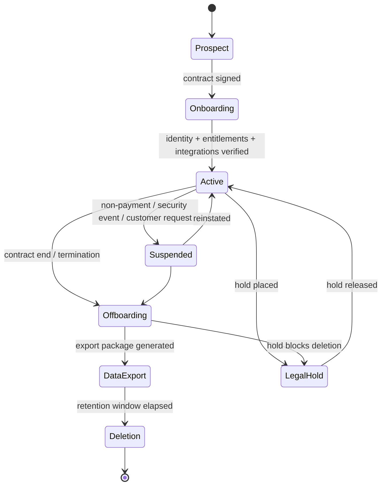
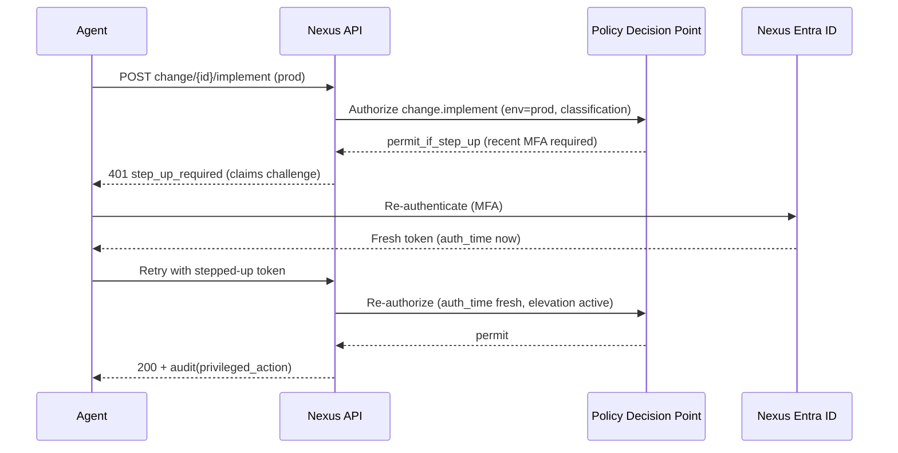

# 02 — Multi-Tenant & Identity Architecture (Sections D, E)

---

## Section D: Multi-Tenant Architecture

### D.1 Tenant hierarchy

Nexus operates as a **tenant-of-tenants**. There is exactly one **Nexus internal tenant** (the operator) and many **customer organization tenants** (isolation boundaries). Customer orgs contain domains, departments, locations, service agreements, assignment groups, and entitlements.

```mermaid
graph TD
  P[Nexus Platform Control Plane] --> NT[Nexus Internal Tenant<br/>employees/agents]
  P --> C1[Customer Org: Acme Corp<br/>org_acme]
  P --> C2[Customer Org: Beta Gov Agency<br/>org_beta]
  P --> C3[Customer Org: Gamma LLC<br/>org_gamma]

  C1 --> D1[Domains: acme.com, acme.net]
  C1 --> DEP1[Departments]
  C1 --> LOC1[Locations]
  C1 --> SA1[Service Agreements / Entitlements]
  C1 --> AG1[Assignment Groups mapping]

  NT --> R1[Roles: Tier1..3, IC, Analysts]
  NT --> AG2[Nexus Assignment Groups]

  subgraph Commercial Enclave
    NT
    C1
    C3
  end
  subgraph Government Enclave (separate deployment + data boundary)
    C2
  end
```

> A customer org lives in **exactly one enclave** (commercial or government). Government customers are provisioned only in the government enclave; their data never transits the commercial enclave. The control plane that *describes* tenants is enclave-local; there is no shared customer data store across enclaves (only non-sensitive operational metadata may be mirrored for fleet dashboards, and only if approved — see D.9).

### D.2 Tenant entities

| Entity | Purpose | Key fields |
|--------|---------|-----------|
| `organization` | Customer isolation boundary | `id`, `name`, `cloud` (commercial/gcc/gcchigh/azgov), `enclave_id`, `status`, `data_boundary`, `primary_idp_id`, `branding_ref` |
| `organization_domain` | Email/identity domain ownership | `org_id`, `domain`, `verified_at`, `verification_method` |
| `organization_department` | Internal customer structure | `org_id`, `name`, `parent_id` |
| `organization_location` | Sites/regions | `org_id`, `name`, `country`, `tz` |
| `organization_contract` | Commercial agreement | `org_id`, `contract_no`, `start`, `end`, `entitlements_ref`, `coverage` (8x5/24x7), `sev_coverage` |
| `support_entitlement` | What's in scope & SLA tier | `org_id`, `service_id`, `sla_tier`, `hours`, `severity_caps` |
| `assignment_group` | Routing target | `id`, `scope` (`nexus`/`org`), `org_id?`, `name`, `members[]` |
| `tenant_metadata` | Operational tags | `org_id`, `health_score`, `csm_id`, `onboarded_at`, `tier` |

### D.3 Tenant isolation strategy

**Layered isolation (defense in depth):**

1. **Enclave isolation (physical/compliance):** separate Azure subscriptions/regions for commercial vs government; no shared data plane.
2. **Database isolation (logical):** Postgres **Row-Level Security** keyed on `organization_id`, set per request from the authenticated principal's scope.
3. **Application guard:** a mandatory `OrgContext` middleware injects `organization_id` into every query builder and rejects any query lacking an org predicate (fail-closed).
4. **Object storage isolation:** blob keys are prefixed `{enclave}/{org_id}/...` and accessed only via short-lived, org-scoped SAS/pre-signed URLs.
5. **Cache/queue isolation:** cache keys and message envelopes carry `org_id`; consumers re-validate scope.
6. **Notification isolation:** templates, branding, and delivery routes are resolved per org; no cross-org recipient leakage.

### D.4 Database isolation options (decision)

| Option | Pros | Cons | Fit |
|--------|------|------|-----|
| **Shared DB + RLS** (row-level security, `org_id` discriminator) | Cheap, simple ops, fast onboarding, easy cross-customer Nexus queries (with elevation) | Noisy-neighbor risk; RLS misconfig = breach; "shared fate" | **Default for commercial enclave** |
| **Per-tenant database / schema** | Strong isolation, per-tenant backup/restore, per-tenant CMK natural | Onboarding overhead, migration fan-out, cross-customer reporting harder | **Opt-in for high-sensitivity / regulated commercial customers** |
| **Hybrid** (shared DB default, dedicated DB for flagged tenants) | Best of both; flag escalates a tenant to dedicated | Two code paths for backup/migration | **Recommended overall model** |
| **Government enclave** | Entire enclave separate; within it, shared-DB+RLS again | Separate ops footprint | **Mandatory for gov customers** |

**Recommendation:** **Hybrid.** Commercial enclave uses shared DB + RLS by default; a `dedicated_db` tenant flag promotes a customer to a dedicated database (used for CMK/BYOK and high-sensitivity). Government enclave is a wholly separate deployment that internally uses shared-DB+RLS across gov customers (or per-tenant DB for CUI-heavy customers). RLS is **belt-and-suspenders** with the app-layer org guard — neither alone is trusted (see [09](./09-data-api-events.md) for DDL + RLS policy and [Section AA](./11-roadmap-build-test.md) tenant-isolation tests).

### D.5 Data ownership

The **customer owns its data**; Nexus is processor/custodian. Posture data, tickets, attachments, and identities belonging to an org are the org's. Nexus owns operational metadata (SLA timers, internal notes, cross-customer aggregates). Internal notes are Nexus-authored and **not** customer-visible but remain part of the customer record for audit/eDiscovery. Ownership drives export and deletion rights (D.8).

### D.6 Data residency & sovereignty

| Control | Mechanism |
|---------|-----------|
| Region pinning | `organization.data_boundary` (e.g., `usgov-virginia`, `us-east`, `eu`) selects storage/DB region; enforced at provisioning |
| Gov sovereignty | Gov enclave in Azure Government regions only; gov identity authorities; national-cloud Graph endpoints |
| CUI handling | Fields tagged `cui` are stored only in the gov enclave; export controlled; access requires cleared role + step-up |
| No cross-boundary processing | AI providers, search indices, and email relays are region/enclave-local; no data egress to commercial services for gov tenants |

### D.7 Tenant lifecycle



**Onboarding workflow (summary):** create org → set cloud/enclave/data_boundary → verify domains → configure customer IdP federation + admin consent (capture consent evidence) → import users (SCIM/JIT) → define entitlements/SLA → connect integrations (Graph/Defender/Intune) → seed posture profile → enable portal & branding → go-live checklist sign-off. (Operational detail: [Section X](./10-stack-ux-ops.md).)

**Suspension:** disables portal logins and integration polling; preserves data; agents retain read for wind-down with reason logging.

**Offboarding:** freeze writes → generate data export package (tickets, attachments, posture, evidence, audit subset) in machine-readable + PDF → deliver via secure channel → enter retention window → **certified deletion** (crypto-erase of per-tenant keys for dedicated-DB/CMK tenants; row purge + backup expiry for shared) → produce deletion certificate (compliance evidence). **Legal hold** blocks deletion and freezes mutation/retention for in-scope data; eDiscovery export available to authorized auditors.

### D.8 Data export & deletion

| Capability | Detail |
|------------|--------|
| Export | On-demand and at offboarding; formats: JSON/NDJSON + CSV + PDF summaries; attachments as ZIP with manifest + checksums; scoped to one org |
| Deletion | Soft-delete → retention timer → hard delete; CMK tenants use crypto-erase; deletion certificate emitted as evidence artifact |
| Legal hold | Per-org or per-matter; suspends deletion + retention expiry; auditable place/release |
| eDiscovery | Auditor-scoped search/export with full access logging |

### D.9 Cross-enclave fleet visibility (constrained)

Nexus leadership wants one fleet view, but gov data must not leave the gov enclave. **Resolution:** each enclave emits only **non-sensitive aggregate metrics** (counts, SLA %, posture scores as numbers — no ticket bodies, no PII, no CUI) to a **commercial fleet-metrics store**, and only when contract + compliance allow. Customers/contracts may opt a tenant out of even aggregate mirroring; gov customers default to **no mirroring** unless explicitly authorized. Detailed per-customer gov views are accessed *inside* the gov enclave by authorized Nexus gov-cleared staff.

---

## Section E: Identity & Access Architecture

### E.1 Principles

- Two disjoint identity planes (Nexus vs Customer), per [01 §C.1](./01-foundation.md).
- **Token-based, zero-trust:** every request carries a validated bearer token (OIDC) or session bound to a validated token; the API performs full issuer/audience/signature/expiry validation and then PDP authorization.
- **No shared secrets where avoidable:** prefer certificate credentials and managed identities for app-to-Microsoft auth; secrets only as last resort with rotation.
- **Per-cloud identity authorities** resolved via the integration abstraction layer (E.6).

### E.2 Nexus employee SSO

- Nexus employees authenticate to the **Nexus Entra ID** tenant (separate tenant instance per enclave: commercial Nexus tenant; gov Nexus tenant in Azure Government / GCC High).
- Enforced: **MFA**, **Conditional Access** (compliant device, location, sign-in risk), **PIM/JIT** for privileged roles, **break-glass** accounts (excluded from CA, hardware-stored, monitored).
- App registration: **single-tenant** app in the Nexus tenant; roles surfaced via app roles / security groups mapped to platform roles.
- Session: short access-token lifetime (e.g., 15–60 min), refresh with rotation; **step-up auth** (re-MFA) required for `admin.superuser`, `posture.write` on CUI, `change.implement` in prod, break-glass.

### E.3 Customer SSO & external identity

Customers authenticate against **their own IdP**. Supported methods and recommended use:

| Method | When used | Cloud notes |
|--------|-----------|-------------|
| **Entra ID (their tenant) via OIDC** | Default for Microsoft customers | Authority differs per cloud (E.6); 🔍 validate GCC High cross-tenant |
| **B2B / external identity (guest)** | When customer prefers Nexus-tenant federation | Cross-cloud B2B (commercial↔gov) is **🟡/🔍 limited** — validate; often not supported commercial↔GCC High |
| **External ID / B2C-style** | High-volume end users without their own IdP | Commercial ✅; gov 🔍 (Azure AD B2C availability in gov differs) |
| **SAML 2.0 / generic OIDC federation** | Non-Microsoft customer IdPs (Okta, Ping, Google) | Cloud-agnostic at app layer |
| **Email magic link** | Approved low-assurance end-user access | Requires email deliverability (gov email constraints, see [06](./06-notifications-m365.md)); off by default for sensitive tenants |
| **Local account (controlled fallback)** | Only when no IdP available | MFA mandatory, admin-approved, time-boxed, audited |
| **Customer break-glass** | Emergency customer-admin access | Separate, monitored, alerts Nexus security |

**Identity provider model:** each org has one or more `identity_provider` records (`type`, `issuer`, `authority`, `client_id`, `jwks_uri`, `claim_mappings`, `domain_restrictions`). Login resolves the IdP by **email-domain → org → IdP** (E.7).

### E.4 Per-cloud Entra ID & authorities

| Cloud | Login authority (illustrative — 🔍 validate against current Microsoft docs) | Graph endpoint |
|-------|------------------------------------------------------------------|----------------|
| Commercial | `https://login.microsoftonline.com/{tenant}` | `https://graph.microsoft.com` |
| GCC | `https://login.microsoftonline.com/{tenant}` (commercial identity, gov data) | `https://graph.microsoft.com` |
| GCC High | `https://login.microsoftonline.us/{tenant}` | `https://graph.microsoft.us` |
| Azure Government / DoD | `https://login.microsoftonline.us/{tenant}` | `https://graph.microsoft.us` (DoD: `dod-graph.microsoft.us`) |

> These are configured as data in `cloud_environments` (see [09](./09-data-api-events.md)), never hardcoded. **All gov endpoints are 🔍 Requires validation** against the live tenant at onboarding — Microsoft national-cloud endpoints and B2B/B2C availability change and differ by license.

### E.5 App registration strategy (decision)

| Model | Use | Trade-off |
|-------|-----|-----------|
| **Single-tenant (Nexus app)** for the platform itself | Platform auth, Nexus employee SSO | Simple, controlled |
| **Multi-tenant app** for customer Graph integrations | One app, customers admin-consent into their tenant | Lower per-customer overhead; but cross-cloud multi-tenant apps are **🔍 limited** (a commercial multi-tenant app generally cannot be consented in GCC High) |
| **Per-customer (per-tenant) app registration** | High-sensitivity / gov customers; isolates consent & secrets | More overhead; strongest isolation & revocation |

**Recommendation:** **Per-cloud multi-tenant app for commercial/GCC**, and **per-customer single-tenant app registrations for GCC High / Azure Government and any CUI customer** (separate app objects in the gov authority, certificate-credentialed). This gives clean per-customer consent revocation and avoids cross-cloud multi-tenant limitations. Every consent is captured as a `consent_record` evidence artifact (admin who consented, scopes, timestamp, tenant).

### E.6 Admin consent & consent evidence

```mermaid
sequenceDiagram
  participant CA as Customer Global Admin
  participant NX as Nexus Portal
  participant ENT as Customer Entra ID (cloud-specific authority)
  participant EV as Evidence Store
  NX->>CA: Send admin-consent URL (per-cloud authority, scoped permissions)
  CA->>ENT: Authenticate + review requested scopes
  ENT->>CA: Show consent prompt (app perms minimized)
  CA->>ENT: Grant admin consent
  ENT-->>NX: Redirect with tenant_id + grant result
  NX->>EV: Persist consent_record (admin upn, scopes, tenant, time, cloud)
  NX->>NX: Mark integration "consented"; begin scoped token acquisition (cert cred)
```

Consent uses **minimum scopes** (E.9). Consent records are immutable evidence supporting compliance (NIST AC/CM controls).

### E.7 Login flow & tenant resolution

```mermaid
sequenceDiagram
  participant U as User
  participant APP as Nexus Web App
  participant RES as IdP Resolver
  participant IDP as Customer/Nexus IdP
  participant API as Nexus API (token validation + PDP)
  U->>APP: Visit portal / enter email
  APP->>RES: Resolve IdP by email domain
  alt Domain maps to a Nexus employee
    RES-->>APP: Nexus Entra ID (enclave authority)
  else Domain maps to a customer org
    RES-->>APP: org's identity_provider (authority, client_id)
  else No mapping
    RES-->>APP: Offer magic link / local fallback (if allowed)
  end
  APP->>IDP: OIDC auth request (PKCE) to resolved authority
  IDP->>U: Authenticate + MFA + CA
  IDP-->>APP: id_token + code
  APP->>API: Exchange code; API validates issuer/audience/signature/nonce/expiry
  API->>API: Map claims → principal (plane, org, roles via group/claim mapping)
  API-->>APP: Session (httpOnly, short-lived) + scoped capabilities
```

### E.8 Provisioning: JIT & SCIM

| Mechanism | Use | Notes |
|-----------|-----|-------|
| **JIT provisioning** | Default for customer end users | On first SSO, create `user` + `user_identity` from validated claims; assign default role (End User) within their org; admin can elevate |
| **SCIM 2.0** (option) | Customer orgs wanting lifecycle sync | Customer IdP pushes create/update/deactivate; maps groups→roles; deprovision on offboard | 🔍 SCIM endpoints over gov network boundaries validate |
| **Domain verification** | Required before an org's domain federates | DNS TXT or email challenge; recorded with method + timestamp |

### E.9 Permission minimization (Graph scopes)

Request only what each capability needs; never `.ReadWrite.All` when `.Read.All` or a resource-specific scope suffices. Examples (illustrative — 🔍 validate availability per cloud):

| Capability | Scope (least privilege) | Type |
|------------|--------------------------|------|
| Posture: identity/MFA/CA read | `Policy.Read.All`, `UserAuthenticationMethod.Read.All`, `Directory.Read.All` | Application |
| Posture: device/Intune | `DeviceManagementManagedDevices.Read.All` | Application |
| Posture: Defender/secure score | `SecurityEvents.Read.All` / Security Graph (🔍 gov availability) | Application |
| Mail ingestion (shared mailbox) | `Mail.Read` on a specific mailbox via app-only + RBAC restriction | Application |
| Mail send | `Mail.Send` restricted to a service mailbox | Application |
| Teams notify | Channel-scoped (🔍 gov; see [06](./06-notifications-m365.md)) | App/Delegated |

### E.10 Token & session security

- **Validation:** signature (JWKS from cloud-correct issuer), issuer match to org's configured authority, audience == platform app, `exp`/`nbf`/`nonce`, and (for customers) tenant id matches the org's federated tenant. Reject tokens from unexpected issuers (prevents tenant confusion).
- **Sessions:** httpOnly + Secure + SameSite cookies bound to a server-side session referencing the validated token; short idle and absolute lifetimes; refresh rotation with reuse detection.
- **Step-up:** sensitive verbs require a recent `auth_time`/`amr` (re-MFA) or fail with `step_up_required`.

### E.11 Privileged access, break-glass, service & workload identity

| Item | Design |
|------|--------|
| **PIM / JIT elevation** | Privileged platform roles (`admin.superuser`, cross-customer scope, `change.implement` prod) are activated time-boxed with justification + approver; activation/deactivation audited; auto-expire |
| **Break-glass** | Two+ hardware-secured accounts per enclave, excluded from CA automation, sealed credentials, use triggers immediate SIEM alert + mandatory post-use review |
| **Service accounts** | Avoided for interactive use; where unavoidable, non-interactive, vaulted, rotated, monitored |
| **Managed identities** | Azure workloads use system/user-assigned managed identities for Key Vault, Storage, SQL, Service Bus — **secretless** |
| **Workload identity federation** | CI/CD and cross-cloud workloads use federated credentials (OIDC) instead of stored secrets where supported (🔍 validate in Azure Government) |
| **Certificate auth** | Graph app auth uses certificate credentials (Key Vault-stored, auto-rotated) over client secrets |
| **Secret rotation** | All remaining secrets/certs rotated on schedule via Key Vault + automated renewal of Graph subscriptions/credentials; expiry alerts |

### E.12 Identity sequence — step-up for a privileged action


