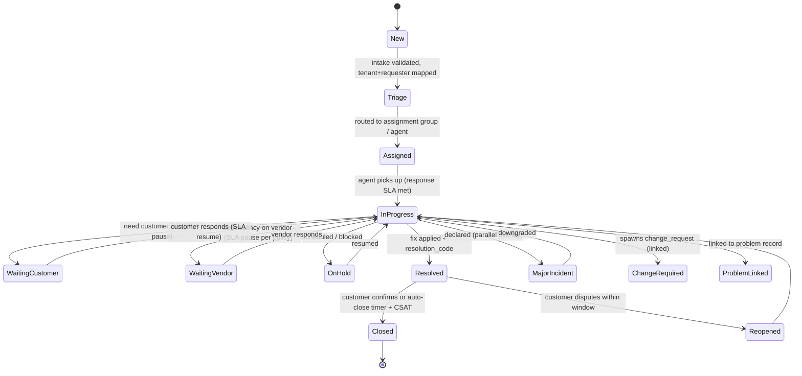

# 03 — Ticketing Domain & Intake (Sections F, G)

---

## Section F: Ticketing Domain

### F.1 Ticket types

| Type | ITIL practice | Description | Default SLA driver |
|------|---------------|-------------|--------------------|
| `incident` | Incident Mgmt | Unplanned disruption / degradation | Impact × Urgency → Priority |
| `service_request` | Request Fulfillment | Standard catalog request | Request type SLA |
| `access_request` | Request Fulfillment | Access/identity change (often needs approval) | Approval + fulfillment SLA |
| `change_request` | Change Enablement | Planned change to a CI/service | CAB + scheduled window |
| `problem` | Problem Mgmt | Root cause of recurring incidents | Investigation SLA |
| `major_incident` | Major Incident Mgmt | High-impact incident; bridge + IC | Severity-1/2 response |
| `security_event` | Security Ops | Security-relevant event/alert | Severity-based |
| `posture_finding` | Posture (Nexus-native) | Finding from posture DB requiring action | Remediation SLA by risk |
| `monitoring_alert` | Event Mgmt | Alert from monitoring → ticket | Severity-based |
| `customer_question` | Service Desk | Q&A / how-to | Response SLA |
| `billing_support` | Business | Contract/entitlement/billing query | Response SLA |

All types share one `tickets` table with a `type` discriminator + type-specific `custom_fields` and `ticket_forms` (F.3). One severity/priority model and one SLA engine serve all types (principle P9).

### F.2 Ticket fields (authoritative)

| Field | Type | Notes |
|-------|------|-------|
| `id` | uuid | Internal PK |
| `ticket_number` | string | Public, per-org sequence, e.g. `ACME-INC-001234` |
| `organization_id` | uuid (FK) | **Isolation key** (RLS) |
| `type` | enum | F.1 |
| `requester_id` | uuid (FK users) | Who reported |
| `affected_user_id` | uuid (FK users) | Who is impacted (may differ) |
| `contact_method` | enum | portal/email/teams/phone/api |
| `source_channel` | enum | See [Section G](#section-g-intake-channels) |
| `category` / `subcategory` | enum/string | Catalog taxonomy |
| `service_id` | uuid (FK services) | Affected service |
| `ci_id` / `asset_id` | uuid (FK) | Configuration item / asset |
| `impact` | enum (1–4) | Org/business scope |
| `urgency` | enum (1–4) | Time sensitivity |
| `priority` | enum (P1–P4) | Derived from impact×urgency (F.4) |
| `severity` | enum (Sev1–Sev4) | For incidents/security/major |
| `status` | enum | F.5 state machine |
| `assignment_group_id` | uuid (FK) | Routing target |
| `assigned_agent_id` | uuid (FK users) | Current owner (Nexus) |
| `sla_policy_id` | uuid (FK) | Applied policy |
| `response_due_at` / `resolution_due_at` | timestamptz | SLA targets |
| `last_customer_update_at` / `last_internal_update_at` | timestamptz | Activity tracking |
| `tags` | string[] | incl. `security`, `vip`, `cui` |
| `custom_fields` | jsonb | Per-form fields |
| `parent_ticket_id` | uuid | Hierarchy |
| `child_ticket_ids` | (via ticket_links) | Tasks/sub-items |
| `linked_posture_finding_id` | uuid (FK) | Posture linkage |
| `linked_change_id` / `linked_problem_id` | uuid (FK) | ITIL linkage |
| `resolution_code` | enum | e.g. fixed/workaround/no-fault/duplicate |
| `closure_notes` | text | Customer-visible summary |
| `satisfaction_score` | int / enum | CSAT after close |
| `created_at` / `updated_at` / `resolved_at` / `closed_at` | timestamptz | |
| (relations) | — | `comments`, `internal_notes`, `attachments`, `events`, `watchers`, `links` |

**Attachments, internal notes, customer-visible comments** are separate child entities (see [09](./09-data-api-events.md)). Internal notes are never exposed to customer plane (enforced by ABAC `resource.visibility`). The **audit trail** is the `ticket_events` append-only stream (every field change, assignment, status transition, SLA event, comment).

### F.3 Ticket forms & custom fields

- `ticket_forms` define the intake schema per `type` + `category` (and optionally per org). Fields: label, key, datatype, required, validation, visibility (customer/internal), default, options.
- `custom_fields` jsonb on the ticket stores values; reporting can index hot fields via generated columns.
- Forms inherit from global defaults; orgs override/add fields (principle P8).

### F.4 Priority & severity derivation

```text
priority_matrix[impact][urgency]:
            Urgency1  Urgency2  Urgency3  Urgency4
  Impact1     P1        P1        P2        P3
  Impact2     P1        P2        P2        P3
  Impact3     P2        P2        P3        P4
  Impact4     P3        P3        P4        P4

function derive_priority(impact, urgency, overrides):
    p = priority_matrix[impact][urgency]
    if ticket.tags contains "vip": p = bump_up(p, 1)
    if org.entitlement.priority_caps applies: p = clamp(p, org caps)
    return p

# Severity (for incident/security/major) is set explicitly by triage or
# auto-mapped from priority; Sev1 ↔ P1 major-incident-eligible.
```

### F.5 Status model & lifecycle

States: `new → triage → assigned → in_progress → (waiting_customer | waiting_vendor | on_hold) → resolved → closed`, with `reopened`, and overlays `major_incident`, `change_required`, `problem_linked`, `posture_linked`.



**Transition rules (representative):**

| From → To | Guard | Side effects |
|-----------|-------|--------------|
| New→Triage | tenant + requester resolved, spam/malware clean | start response SLA timer |
| Triage→Assigned | assignment group set | notify group; `ticket.assigned` event |
| →WaitingCustomer | reason required | **pause** resolution SLA (per policy); notify customer |
| WaitingCustomer→ (auto-close) | no response > N days | reminder → auto-resolve with note |
| InProgress→Resolved | resolution_code + closure_notes set | stop SLA; CSAT request; `ticket.resolved` |
| Resolved→Closed | confirm or timer | `ticket.closed`; lock edits except reopen window |
| Resolved→Reopened | within reopen window only | restart appropriate SLA; `ticket.reopened` |
| →MajorIncident | `mim.declare` perm + Sev1/2 | open MIM bridge, page IC/on-call, broadcast |

### F.6 Ticket workflows (narrative)

- **New ticket → Triage:** validate intake (channel rules, [Section G](#section-g-intake-channels)), dedupe, map org + requester, classify (manual or AI-suggested), set impact/urgency → priority, apply SLA policy, route to assignment group.
- **Assignment:** auto-routing rules (by service, category, customer, skill) or manual; round-robin / load-based within a group; respects on-call for severity-eligible types.
- **Escalation:** time-based (SLA breach risk), manual, or rule-based → reassign group/tier, page on-call, notify managers ([Section H](./04-sla-oncall.md)).
- **Waiting states:** pause/resume SLA per policy; reminders to the awaited party.
- **Resolved/Closed/Reopened:** as F.5; CSAT captured on close.
- **Major incident declared:** overlay opens bridge, IC assigned, stakeholder comms cadence, post-incident review record created on close.
- **Change/Problem/Posture linkage:** a ticket can spawn or link to a `change_request`, `problem`, or `posture_finding`; links are bidirectional via `ticket_links`.

### F.7 Merge, link, parent/child

- **Merge:** `ticket.merge` combines duplicates; source becomes `merged_into`; comments/attachments migrate; requesters notified; audited.
- **Parent/child:** a request can fan out into child tasks (fulfillment steps); parent closes when children complete (configurable).
- **Links:** typed relationships (`duplicate_of`, `caused_by`, `related_to`, `blocks`, `child_of`) in `ticket_links`.

---

## Section G: Intake Channels

### G.1 Channel matrix & cloud support

| Channel | Auth | Cloud support | Notes |
|---------|------|---------------|-------|
| **Customer portal** | Customer SSO/magic link/local | Commercial ✅ / GCC ✅ / GCC High ✅ / AzGov ✅ | Primary channel; fully cloud-portable |
| **Agent-created** | Nexus SSO | ✅ all | On behalf of customer |
| **Email ingestion (per-org inbound address)** | Verified sender domain + SPF/DKIM/DMARC checks | Commercial ✅ / GCC 🔍 / GCC High 🔍 / AzGov 🔍 | Graph mail or inbound relay; gov mail flow validate |
| **Shared mailbox ingestion** | App-only Graph `Mail.Read` on mailbox | Commercial ✅ / GCC 🔍 / GCC High 🔍 / AzGov 🔍 | Graph national endpoints; throttling |
| **Teams message intake** | Teams identity | Commercial 🟡 / GCC 🔍 / GCC High 🔍 / AzGov 🔍 | Bot/app availability differs in gov |
| **Teams bot intake** | Bot Framework | Commercial 🟡 / GCC 🔍 / GCC High ❌/🔍 / AzGov 🔍 | Bot Framework gov availability limited — **requires validation / alternate** |
| **API-created** | API client (OAuth client-credential / mTLS) | ✅ all | For integrations |
| **Webhook-created** | Signed webhook (HMAC) + allowlist | ✅ all | Inbound from external systems |
| **Monitoring-alert-created** | API/webhook from monitoring | ✅ all | Maps alert → incident |
| **Posture-finding-created** | Internal event | ✅ all | Finding → ticket (Nexus-native) |
| **Scheduled ticket** | System | ✅ all | Recurring maintenance/review |
| **Bulk import** | Agent/admin (CSV) | ✅ all | Migration/onboarding |

### G.2 Per-channel processing pipeline

Every inbound item runs a common pipeline; channel-specific steps noted.

```mermaid
flowchart LR
  A[Inbound item] --> B[Authenticate / verify source]
  B --> C[Validate schema/content]
  C --> D[Spam filter]
  D --> E[Malware scan attachments]
  E --> F[Tenant mapping (domain → org)]
  F --> G[Requester mapping (sender → user, JIT if new)]
  G --> H[Deduplicate (thread/hash/heuristic)]
  H --> I{New or update?}
  I -->|update| J[Append comment/attachment to existing ticket]
  I -->|new| K[Apply routing rules → create ticket]
  K --> L[Emit ticket.created + audit]
  J --> L
  B -. fail .-> X[Quarantine + audit + notify ops]
  E -. infected .-> X
  F -. no match .-> Y[Unmatched queue: manual org assignment]
```

| Step | Detail |
|------|--------|
| **Authentication** | Portal: session; Email: SPF/DKIM/DMARC + known-domain check; API: OAuth/mTLS; Webhook: HMAC signature + IP allowlist + replay nonce |
| **Validation** | Required fields, size limits, content-type allowlist, encoding checks; reject/queue on failure |
| **Deduplication** | Email: `Message-ID`/`In-Reply-To`/thread; others: content hash + (requester+subject+time window) heuristic; AI duplicate-detection optional ([08](./08-ai-security-compliance.md)) |
| **Spam filtering** | Reputation + heuristics + rate per sender; quarantine queue |
| **Malware scanning** | All attachments scanned before storage becomes accessible; infected → quarantine, never delivered to ticket; see [Security](./08-ai-security-compliance.md) |
| **Tenant mapping** | Sender domain → `organization_domain` → org; ambiguous/unknown → Unmatched queue (no default-org leakage) |
| **Requester mapping** | Match to `user`; JIT-create End User if domain is verified for the org; else hold for verification |
| **Routing rules** | Per org/global rules → assignment group, category, SLA; default group fallback |
| **Error handling** | DLQ for processing failures; quarantine for security; Unmatched queue for mapping; all paths audited |
| **Audit trail** | Each step emits a `ticket_event`/`audit_log` with channel, decision, and reason |

### G.3 Email ingestion specifics

- **Inbound address per org** (e.g., `acme@support.nexus.com` or customer-routed). Mapping by To/From domain.
- **Threading:** replies append to the originating ticket via `Message-ID` correlation embedded in outbound notifications (`[ACME-INC-001234]` token + `References` header).
- **Security:** reject spoofed senders (DMARC fail), strip active content, scan attachments, cap size, rate-limit.
- **Gov clouds:** mail flow (Exchange Online Protection, connectors, Graph mail) differs; **🔍 requires validation** — alternate is a customer-hosted connector forwarding to an enclave-local relay. See [06 §L](./06-notifications-m365.md).

### G.4 Teams intake specifics

- Commercial: an app/bot can create tickets from a message/action; **🟡** requires app deployment + permissions.
- Gov: Bot Framework and Graph Teams APIs availability/feature parity differ across GCC/GCC High/AzGov — **🔍 / ❌ in some** ; **alternate**: link-out to portal + Adaptive Card where supported, or disable Teams intake and rely on portal/email. Capability resolved per cloud via the integration matrix ([06](./06-notifications-m365.md)).

### G.5 Bulk import & migration

- CSV/NDJSON import with a mapping wizard; dry-run validation; per-row error report; idempotent (external key dedupe); audited; rate-limited; produces an import manifest (evidence for onboarding).
