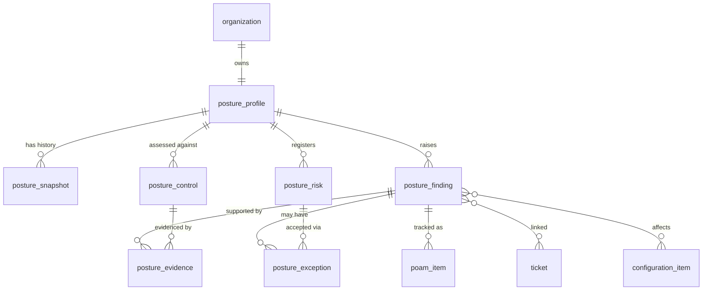
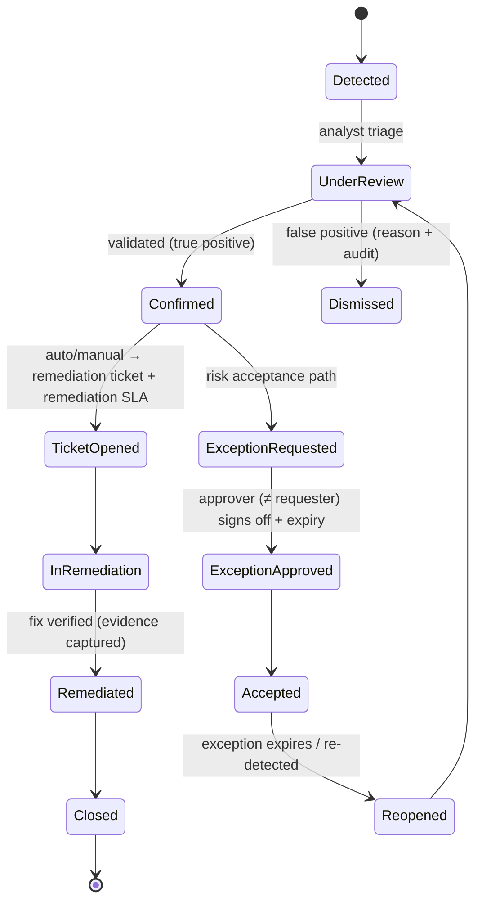
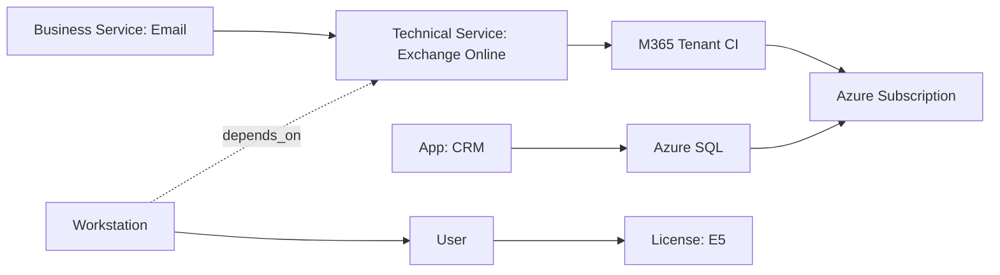

# 05 — Posture Database & CMDB (Sections I, J)

---

## Section I: Posture Database

The posture database is a **first-class system of record** (principle P12) tracking every supported customer's operational, cloud, security, compliance, and service posture. It is natively linked to tickets, SLAs, on-call, evidence, and reporting.

### I.1 Posture entity model



| Entity | Purpose | Key fields |
|--------|---------|-----------|
| `posture_profile` | Per-org posture root (and sub-profiles per tenant/subscription/domain) | `id`, `org_id`, `scope_type` (org/m365_tenant/azure_sub/domain), `scope_ref`, `overall_score`, `review_cadence`, `owner_id`, `last_reviewed_at` |
| `posture_snapshot` | Point-in-time immutable capture | `id`, `profile_id`, `captured_at`, `source` (graph/defender/intune/azure/manual/csv), `metrics` jsonb, `score`, `hash` |
| `posture_finding` | An issue requiring action | `id`, `org_id`, `profile_id`, `title`, `domain` (identity/device/email/backup/patch/vuln/compliance...), `severity`, `risk_score`, `status`, `control_refs[]`, `ci_refs[]`, `discovered_at`, `remediation_due_at`, `owner_id`, `linked_ticket_id` |
| `posture_control` | Control assessment state | `id`, `org_id`, `framework` (NIST80053/80171/CMMC/FedRAMP), `control_id`, `implementation_status`, `assessed_at`, `assessor_id`, `notes` |
| `posture_evidence` | Evidence artifact | `id`, `org_id`, `subject_type` (finding/control/snapshot), `subject_id`, `type` (screenshot/export/config/attestation), `blob_ref`, `collected_at`, `collected_by`, `hash`, `immutable` |
| `posture_exception` | Risk acceptance / waiver | `id`, `org_id`, `finding_id?`, `risk_id?`, `justification`, `approved_by`, `approved_at`, `expires_at`, `compensating_controls`, `status` |
| `posture_risk` | Risk register entry | `id`, `org_id`, `title`, `likelihood`, `impact`, `inherent_score`, `residual_score`, `treatment` (accept/mitigate/transfer/avoid), `owner_id`, `review_due` |
| `poam_item` | POA&M tracking | `id`, `org_id`, `finding_id`, `control_id`, `weakness`, `milestones[]`, `scheduled_completion`, `status`, `responsible_party` |

### I.2 Tracked posture domains (sub-profiles / metric groups)

| Domain | Example metrics captured | Primary source |
|--------|--------------------------|----------------|
| M365 tenant posture | Secure Score, sharing/config baselines | Graph / Secure Score (🔍 gov) |
| Azure subscription posture | Defender for Cloud secure score, policy compliance | Azure / Defender for Cloud |
| Identity posture | privileged accounts, stale accounts, guest sprawl | Graph Directory |
| MFA posture | % users with MFA, methods, gaps | Graph auth methods |
| Conditional Access posture | CA policies present/effective, gaps | Graph Policy |
| Privileged access posture | PIM usage, standing admin count | Graph / PIM |
| Device posture | enrolled/compliant device % | Intune |
| Endpoint security / Defender posture | onboarded endpoints, exposure, alerts | Defender |
| Email security posture | SPF/DKIM/DMARC, EOP/anti-phish config | Graph / DNS |
| Backup posture | protected workloads, last successful backup | Azure Backup / connector |
| Patch posture | missing critical patches, update ring health | Intune / Update mgmt |
| Vulnerability posture | open vulns by severity, exposure score | Defender TVM / scanner |
| Asset posture | inventory coverage, unmanaged assets | CMDB + discovery |
| License posture | assigned vs available, over/under-licensing | Graph billing |
| Compliance posture | control implementation % per framework | `posture_control` |
| NIST / CMMC / FedRAMP readiness | control coverage, gaps, POA&M aging | derived |

### I.3 Ingestion methods

| Method | Description | Cloud notes |
|--------|-------------|-------------|
| Manual entry | Analyst records assessment/finding | ✅ all |
| API ingestion | External tools push metrics/findings | ✅ all |
| Microsoft Graph | Identity/MFA/CA/license/secure-score pull (delta where available) | Commercial ✅ / gov 🔍 (national endpoints) |
| Defender ingestion | Endpoint/vuln/alerts | Commercial ✅ / gov 🔍 |
| Intune ingestion | Device/compliance/patch | Commercial ✅ / gov 🔍 |
| Azure ingestion | Defender for Cloud, Policy compliance | Commercial ✅ / AzGov 🔍 |
| CSV import | Bulk/initial load | ✅ all |
| Evidence upload | Files/screenshots/attestations | ✅ all |

All ingestion runs through the integration abstraction layer ([06](./06-notifications-m365.md)) with per-cloud endpoints, throttling, retries, and delta queries; each run records source + hash on the snapshot for tamper-evidence.

### I.4 Findings lifecycle



- **Automated finding generation:** ingestion rules + thresholds create findings (e.g., MFA coverage < 95% → finding). Dedupe against open findings.
- **Ticket generation:** confirmed findings spawn remediation tickets with `remediation` SLA by risk ([04 §H.11](./04-sla-oncall.md)).
- **Closure controls:** remediation requires verifying evidence; closure of compliance-relevant findings requires Compliance/Security Analyst sign-off (separation of duties — analyst who wrote ≠ approver of exception).

### I.5 Risk scoring & posture scoring

```text
# Finding risk score (0-100)
risk_score = clamp( base_severity_weight[severity]
                    * exposure_factor(internet_facing, data_classification)
                    * asset_criticality_factor(ci.criticality)
                    - compensating_control_credit, 0, 100)

# Domain score (0-100) — higher is better
domain_score(domain) = 100 - weighted_sum(open_findings_in_domain by risk_score)

# Overall posture score = weighted average of domain scores,
# weights configurable per customer program (e.g., identity & email weighted high)
overall_score = Σ (domain_weight[d] * domain_score(d)) / Σ domain_weight[d]

# Executive posture score = overall_score banded:  A(90-100) B(80-89) C(70-79) D(60-69) F(<60)
```

Scores are recomputed on each snapshot and on finding state changes; history retained in `posture_snapshot` for **trend analysis**.

### I.6 Evidence lifecycle

`collected → validated → linked (to finding/control/snapshot) → retained (immutable, hashed) → packaged (audit export) → expired/archived per retention`. Evidence is write-once (immutable flag), hashed for integrity, access-logged, and assembled into **compliance evidence packages** ([Section R](./08-ai-security-compliance.md)).

### I.7 Exception lifecycle

`requested → reviewed → approved (with expiry + compensating controls) → active → expiring (warning) → expired (finding reopens)`. Approver must differ from requester; all transitions audited; expiry auto-reopens the underlying finding.

### I.8 Access model

| Action | Required permission | Scope |
|--------|---------------------|-------|
| Read posture | `posture.read` | Own org (customer) / assigned orgs (Nexus) |
| Write/assess | `posture.write` | Nexus Security Analyst, assigned orgs |
| Manage findings | `posture.finding.manage` | Nexus Security Analyst |
| Request exception | `posture.request_exception` | Security Analyst or Customer Security Contact |
| Approve exception | `posture.approve_exception` | Compliance/Manager (≠ requester) |
| Manage evidence | `evidence.manage` | Compliance Analyst |
| Manage POA&M | `poam.manage` | Compliance Analyst |

Customer Security/Auditor/Exec personas get **read** (and exception *request*) only; they never write posture state.

### I.9 UI model (summary; full screens in [Section W](./10-stack-ux-ops.md))

- **Customer posture dashboard:** score, banded grade, domain breakdown, trend, open findings, exceptions, remediation SLA status, downloadable evidence/QBR.
- **Nexus posture DB dashboard:** cross-customer fleet posture, worst-N customers, finding aging, exception expiries, ingestion health.
- **Finding detail:** description, affected CIs, risk score, evidence, linked ticket, remediation plan, history.
- **Evidence upload:** drag-drop, type tagging, hash on store, link to finding/control.

### I.10 Reporting & ticket-linkage model

- Findings ↔ tickets are linked bidirectionally; remediation progress reflects in both posture and ITSM dashboards.
- Posture feeds: executive posture score, customer health score ([Section O](./07-automation-kb-reporting.md)), QBR packages, audit exports, compliance evidence packages.

### I.11 Schema (illustrative DDL)

```sql
CREATE TABLE posture_profile (
  id            uuid PRIMARY KEY DEFAULT gen_random_uuid(),
  org_id        uuid NOT NULL REFERENCES organization(id),
  scope_type    text NOT NULL,           -- org | m365_tenant | azure_sub | domain
  scope_ref     text,
  overall_score numeric(5,2),
  review_cadence interval,
  owner_id      uuid REFERENCES users(id),
  last_reviewed_at timestamptz,
  created_at    timestamptz NOT NULL DEFAULT now()
);
CREATE INDEX ix_posture_profile_org ON posture_profile(org_id);

CREATE TABLE posture_snapshot (
  id         uuid PRIMARY KEY DEFAULT gen_random_uuid(),
  org_id     uuid NOT NULL REFERENCES organization(id),
  profile_id uuid NOT NULL REFERENCES posture_profile(id),
  captured_at timestamptz NOT NULL DEFAULT now(),
  source     text NOT NULL,
  metrics    jsonb NOT NULL,
  score      numeric(5,2),
  hash       text NOT NULL                 -- integrity of metrics payload
) PARTITION BY RANGE (captured_at);        -- monthly partitions; long retention
CREATE INDEX ix_snapshot_profile_time ON posture_snapshot(profile_id, captured_at DESC);

CREATE TABLE posture_finding (
  id            uuid PRIMARY KEY DEFAULT gen_random_uuid(),
  org_id        uuid NOT NULL REFERENCES organization(id),
  profile_id    uuid NOT NULL REFERENCES posture_profile(id),
  title         text NOT NULL,
  domain        text NOT NULL,
  severity      text NOT NULL,             -- critical|high|moderate|low|info
  risk_score    numeric(5,2),
  status        text NOT NULL DEFAULT 'detected',
  control_refs  text[],
  ci_refs       uuid[],
  discovered_at timestamptz NOT NULL DEFAULT now(),
  remediation_due_at timestamptz,
  owner_id      uuid REFERENCES users(id),
  linked_ticket_id uuid REFERENCES tickets(id),
  created_at    timestamptz NOT NULL DEFAULT now(),
  updated_at    timestamptz NOT NULL DEFAULT now()
);
CREATE INDEX ix_finding_org_status ON posture_finding(org_id, status);
CREATE INDEX ix_finding_due ON posture_finding(remediation_due_at) WHERE status NOT IN ('remediated','closed','accepted');

-- RLS (see 09): every posture_* table enforces org_id = current_setting('app.org_id')
ALTER TABLE posture_finding ENABLE ROW LEVEL SECURITY;
```

(Full table list and conventions: [Section S / 09](./09-data-api-events.md).)

---

## Section J: CMDB & Asset Management

### J.1 CI taxonomy

| CI class | Examples |
|----------|----------|
| Business service | "Email", "Customer Portal access", "Payroll" |
| Technical service | "Exchange Online", "Azure SQL", "VPN" |
| Application | LOB apps, SaaS apps |
| M365 tenant | per-customer tenant CI |
| Azure subscription / resource group | cloud account CIs |
| Device | server, workstation, mobile, network equipment |
| Identity objects | users, groups, shared mailboxes |
| License | M365/Azure license SKUs |
| Vendor / Contract | third parties, agreements |
| Location | sites/regions |

### J.2 CI record (core fields)

`id`, `org_id`, `ci_class`, `name`, `external_ref` (e.g., Azure resource id, Intune device id), `status` (active/retired), `criticality` (1–4), `environment` (prod/test), `owner_id`, `support_group_id`, `location_id`, `attributes` jsonb, `discovered_source`, `last_seen_at`. Linked to tickets, changes, incidents, and posture findings.

### J.3 CI relationship modeling

`ci_relationships(source_ci, target_ci, type)` with types: `depends_on`, `runs_on`, `hosts`, `connects_to`, `member_of`, `uses_license`, `owned_by_vendor`, `located_at`. Enables impact analysis (which services break if a CI fails) and blast-radius for changes/incidents.



### J.4 Import & discovery patterns

| Pattern | Source | Notes |
|---------|--------|-------|
| Graph discovery | users, groups, devices, licenses, mailboxes | scoped read; delta sync; gov endpoints 🔍 |
| Intune discovery | managed devices, compliance | 🔍 gov |
| Azure Resource Graph | subscriptions, resource groups, resources | AzGov 🔍 |
| Agent/CSV import | manual/initial | dedupe by `external_ref` |
| API push | external CMDB/RMM | idempotent upsert |

**Reconciliation:** discovery upserts by `external_ref`; conflicts flagged for analyst; retired CIs soft-deleted with `last_seen_at` aging. CMDB coverage feeds **asset posture** ([I.2](#i2-tracked-posture-domains-sub-profiles--metric-groups)). All CI changes audited; CI edits in prod for critical CIs may require change linkage.
