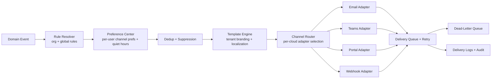
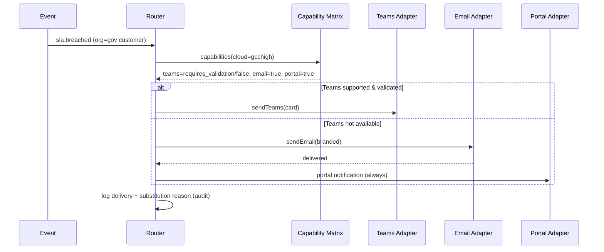

# 06 — Notifications & Microsoft 365 Integration (Sections K, L)

---

## Section K: Notification Architecture

### K.1 Channels & cloud support

| Channel | Status | Commercial | GCC | GCC High | AzGov | Notes |
|---------|--------|-----------|-----|----------|-------|-------|
| Email | Core | ✅ | 🔍 | 🔍 | 🔍 | Send path differs per cloud (L.7) |
| Microsoft Teams | Core | 🟡 | 🔍 | 🔍 | 🔍 | Webhooks/bots/Graph differ; gov 🔍/❌ in places |
| Portal (in-app) | Core | ✅ | ✅ | ✅ | ✅ | Always available; gov fallback |
| Webhook (outbound) | Core | ✅ | ✅ | ✅ | ✅ | Signed; customer/integration sinks |
| SMS | Future | 🔍 | 🔍 | 🔍 | 🔍 | Provider availability in gov 🔍 |
| Voice | Future | 🔍 | 🔍 | 🔍 | 🔍 | Same |
| Mobile push | Future | ✅ | 🔍 | 🔍 | 🔍 | Push service reachability in gov 🔍 |

> **Fallback chain:** for any notification, if the preferred channel is unavailable in a tenant's cloud or fails delivery, the system degrades gracefully: **Teams → Email → Portal**, and **SMS/Voice → Push → Email**. The **Portal notification is the universal floor** (always reachable in every cloud).

### K.2 Notification events

`ticket.created`, `ticket.assigned`, `ticket.commented`, `ticket.status_changed`, `customer.response_required`, `approval.requested`, `approval.completed`, `sla.warning`, `sla.breached`, `ticket.escalated`, `oncall.acknowledgement_required`, `oncall.acknowledged`, `mim.declared`, `mim.updated`, `posture.finding_created`, `posture.finding_breached`, `change.scheduled`, `change.approved`, `maintenance.notice`, `digest.report`.

Each event maps to one or more **notification rules** that resolve recipients, channels, template, and suppression.

### K.3 Architecture



| Component | Responsibility |
|-----------|----------------|
| **Rule resolver** | Org-specific rules override/extend global rules (inheritance, principle P8); resolves recipients by role/subscription/watcher |
| **Preference center** | Per-user channel selection, quiet hours, digest vs immediate; customers manage their own |
| **Template engine** | Handlebars-style templates per event+channel; **tenant branding** (logo, colors, from-name); localization-ready (i18n keys; future translations) |
| **Channel router** | Selects the **per-cloud adapter** from the capability matrix; applies fallback chain |
| **Delivery queue** | Async send with retry (exponential backoff), idempotency keys, **DLQ** on exhaustion |
| **Delivery logs** | `notification_deliveries` with status, attempts, provider response, timestamps → audit + reporting |

### K.4 Suppression, dedup, retry, DLQ

- **Suppression rules:** quiet hours (non-critical), digest batching, per-event opt-outs, severity overrides (Sev1 bypasses suppression).
- **Deduplication:** collapse repeated events for the same ticket within a window into one notification (fatigue control, ties to [04 §H.8](./04-sla-oncall.md)).
- **Retry/DLQ:** failed deliveries retried with backoff; persistent failures → DLQ + ops alert; delivery failures of *paging* notifications escalate the on-call chain rather than silently dropping.

### K.5 Government-cloud adapter model

The router never calls Teams/email/SMS SDKs directly; it calls an **adapter interface** whose implementation is selected by the tenant's `cloud`:

```text
interface NotificationAdapter {
  capabilities(): {teams, email, adaptiveCards, sms, voice, push}  // from matrix
  sendEmail(env): DeliveryResult
  sendTeams(env): DeliveryResult         // may throw NotSupported → fallback
  ...
}
adapters = {
  commercial: CommercialAdapter,   // Graph commercial + Teams webhook/bot
  gcc:        GccAdapter,           // 🔍 validate Teams/email specifics
  gcchigh:    GccHighAdapter,       // national endpoints; Teams limited → portal/email fallback
  azgov:      AzGovAdapter
}
```

If an adapter reports a channel unsupported, the router applies the fallback chain (K.1) and records the substitution in delivery logs (evidence of why Teams was replaced by email in gov).

### K.6 Notification sequence (with fallback)



---

## Section L: Microsoft 365, Graph, Teams & Email Integration

### L.1 Integration abstraction layer

All Microsoft calls route through a single abstraction with **per-cloud endpoint configuration** sourced from `cloud_environments` (data, not code). No commercial endpoint is hardcoded.

```text
class GraphClient(cloud_env, credential):
   base_url      = cloud_env.graph_endpoint        # graph.microsoft.com | graph.microsoft.us | dod-graph.microsoft.us
   authority     = cloud_env.login_authority       # login.microsoftonline.com | .us
   scopes        = minimized_per_capability
   credential    = certificate or managed_identity (preferred) | secret (fallback)
   # built-in: throttling/retry (429/503 + Retry-After), delta queries, paging, telemetry
```

### L.2 Per-cloud endpoint matrix (🔍 validate all gov rows against current Microsoft docs at onboarding)

| Setting | Commercial | GCC | GCC High | AzGov/DoD |
|---------|-----------|-----|----------|-----------|
| Login authority | login.microsoftonline.com | login.microsoftonline.com | login.microsoftonline.us | login.microsoftonline.us |
| Graph endpoint | graph.microsoft.com | graph.microsoft.com | graph.microsoft.us | graph.microsoft.us / dod-graph.microsoft.us |
| Teams | full | 🔍 | 🔍 limited | 🔍 limited |
| Exchange/Mail | full | 🔍 | 🔍 | 🔍 |
| Defender/Security Graph | full | 🔍 | 🔍 | 🔍 |
| Intune | full | 🔍 | 🔍 | 🔍 |

### L.3 Identity & credentials

- **Authority per cloud** (L.2); tenant discovery on onboarding records the customer's tenant id + cloud.
- **App vs delegated:** posture/ingestion use **application permissions** (app-only, certificate-credential); user-context actions use **delegated**.
- **Minimization:** least scopes per capability ([02 §E.9](./02-architecture.md)).
- **Secretless:** prefer **certificate credentials** (Key Vault) and **managed identities** for platform→Azure; **workload identity federation** where supported (🔍 AzGov).
- **Consent evidence:** every admin consent captured ([02 §E.6](./02-architecture.md)).

### L.4 Mail ingestion & sending

| Capability | Mechanism | Cloud |
|------------|-----------|-------|
| Shared-mailbox ingestion | Graph `Mail.Read` (app-only, mailbox-scoped) + delta + subscription | Commercial ✅ / gov 🔍 |
| Inbound routing | Customer routes to per-org address; Graph poll or webhook subscription | gov mail flow 🔍 / alternate relay |
| Mail sending | Graph `Mail.Send` from a service mailbox, OR SMTP relay, OR provider | Commercial ✅ / gov 🔍 (L.7) |

### L.5 Teams integration (decision + cloud reality)

| Mechanism | Commercial | Gov | Recommendation |
|-----------|-----------|-----|----------------|
| Incoming webhook to channel | 🟡 (being deprecated toward Workflows) | 🔍/❌ | Avoid as primary |
| Graph `chatMessage` / channel post (app perms) | ✅ | 🔍 | Preferred where available |
| Bot Framework bot | 🟡 | 🔍/❌ (gov availability limited) | Optional; not on critical path |
| Adaptive Cards | ✅ | 🔍 | Use where Teams supported |

**Recommendation:** Treat Teams as an **enhancement channel, never the only channel.** Use Graph-based channel posting with Adaptive Cards where validated; in gov clouds default to **email + portal** and enable Teams only after per-tenant validation. Channel/user mapping stored per org; `integration.test` button verifies live delivery before enabling.

### L.6 Subscriptions, delta, throttling

- **Webhooks/subscriptions** (Graph change notifications) for mail/events where supported; **auto-renew before expiry** (subscriptions expire); renewal failures alert ops.
- **Delta queries** for incremental directory/device/mail sync (efficiency + throttle avoidance).
- **Throttling:** honor `429`/`Retry-After`, exponential backoff, per-tenant concurrency caps, jittered scheduling for fleet-wide polls (mitigates "integration throttling" risk, [12](./12-risk-adr-diagrams.md)).

### L.7 Email sending in government clouds (explicit)

Commercial SMTP relay / SendGrid-style providers and even Graph `Mail.Send` behavior differ or may be restricted in GCC High / Azure Government. **🔍 Requires validation.** Alternatives, in preference order for gov:
1. **Graph `Mail.Send`** from an enclave service mailbox in the gov tenant (validate scopes + national endpoint).
2. **Exchange Online (gov) connector** from a customer/Nexus gov mailbox.
3. **Gov-authorized email provider / relay** with FedRAMP authorization.
The chosen path is recorded per enclave; portal notifications remain the floor if email is constrained.

### L.8 Integration health & operations

| Feature | Detail |
|---------|--------|
| Health checks | Per integration: token validity, subscription expiry, last successful sync, error rate → `integration_health_checks` |
| Test button | `integration.test` runs a live, side-effect-safe probe (read or test-message) and reports per-capability pass/fail with cloud context |
| Failure alerts | Permission-expired / consent-revoked / throttled / subscription-lapsed → ops ticket + notification (`integration.failed`, `integration.permission_expired`) |
| Consent record keeping | Immutable `consent_record` per grant (evidence) |
| Audit logging | Every Graph call class, target tenant, scopes used, and result summary logged (no sensitive payload) |
| Feature matrix surfacing | Admin UI shows, per tenant, which capabilities are Supported / Partial / Not supported / Requires validation for that cloud |

### L.9 Capability matrix as data

`cloud_environments` + `feature_flags` store, per cloud and per tenant, the resolved capability state. The integration layer and notification router both read this matrix at runtime so that **a single codebase behaves correctly per cloud without branching logic scattered through the app** (principle P5; ADR in [12](./12-risk-adr-diagrams.md)).
