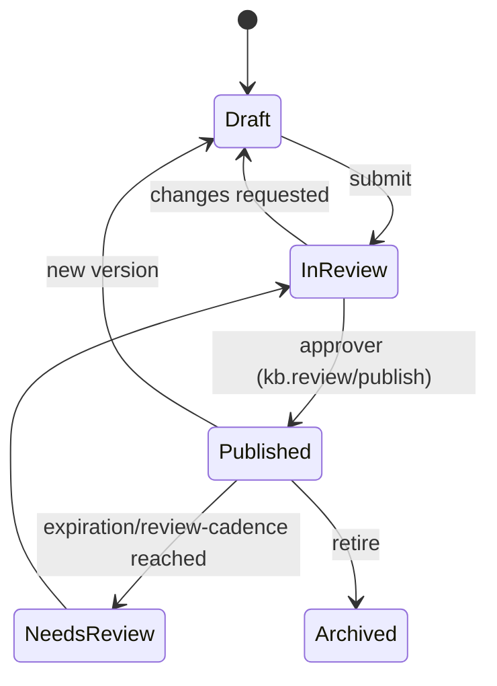

# 07 — Automation, Knowledge Base & Reporting (Sections M, N, O)

---

## Section M: Automation & Workflow Engine

### M.1 Goals & model

An enterprise workflow engine that lets Nexus and (scoped) customers automate ITSM and posture operations safely — **human-in-the-loop by default** (principle P10), versioned, testable, auditable, idempotent, and permission-bounded.

Two authoring surfaces:
- **Rule builder** — condition→action rules ("when X and Y, do Z").
- **Visual workflow builder** — multi-step flows with branching, approvals, and gates (DAG of steps).

### M.2 Triggers

| Trigger | Examples |
|---------|----------|
| Event triggers | any domain event ([Section U / 09](./09-data-api-events.md)): `ticket.created`, `sla.warning`, `posture.finding_created`, etc. |
| Scheduled triggers | cron-like (e.g., nightly stale-ticket sweep, weekly posture review reminder) |
| Manual triggers | agent-invoked action button (`automation.execute_manual`) |

### M.3 Logic

- **Conditional logic & branching:** boolean expressions over event payload + ticket/posture/CI/org attributes; multi-branch `if/elif/else`; switch on field.
- **Approvals / human-in-the-loop gates:** a step can require an approval ([Section N approvals] and `approvals` entity) before continuing; customer-visible or destructive actions force a gate.
- **Customer-specific vs global workflows:** global workflows apply to all orgs; org workflows override/extend (inheritance + override, principle P8).
- **Inheritance & overrides:** a customer can disable or specialize an inherited global rule.

### M.4 Lifecycle: draft → test → publish → version → rollback

```mermaid
stateDiagram-v2
  [*] --> Draft
  Draft --> Testing: run in simulation mode (no side effects)
  Testing --> Draft: adjust
  Testing --> Published: publish (new version; author ≠ publisher for sensitive tenants)
  Published --> Draft: clone to new draft
  Published --> RolledBack: rollback to prior version
  RolledBack --> Published
  Published --> Disabled: deactivate
```



- **Testing/Simulation mode:** executes against real or sample events but **records intended actions without performing them** (dry-run), producing a diff of what would happen.
- **Versioning:** every publish creates an immutable version; `automation_executions` records which version ran.
- **Rollback:** revert active version to a prior one (audited).

### M.5 Safety controls

| Control | Detail |
|---------|--------|
| Permission boundaries | A workflow runs with a **service principal scoped to the org and a capability allowlist**; it can never exceed the author's permissions, and cross-customer actions are forbidden unless explicitly granted |
| Idempotent actions | Each action carries an idempotency key (event id + step id) to prevent double-execution on retry |
| Rate limits | Per-workflow and per-org execution caps; runaway loops circuit-broken |
| Safe retry | Transient failures retried with backoff; non-idempotent steps guarded |
| Dead-letter queue | Failed executions → DLQ + alert; never silently dropped |
| Loop/recursion guards | Detect workflow-triggers-workflow cycles; depth cap |
| Audit & execution logs | `automation_executions` (trigger, version, inputs hash, steps, outcomes) + `audit_logs` for privileged actions |

### M.6 Action catalog

`assign_ticket`, `change_priority`, `change_status`, `add_comment`, `add_internal_note`, `notify_user`, `notify_teams_channel`, `start_approval`, `create_child_ticket`, `link_posture_finding`, `create_posture_finding`, `escalate_ticket`, `page_oncall`, `apply_sla`, `update_custom_field`, `call_webhook`, `create_report`, `close_stale_ticket`, `reopen_ticket`.

Each action declares: required permission, idempotency behavior, whether it is **customer-visible** (forces approval gate), and cloud constraints (e.g., `notify_teams_channel` honors the capability matrix and falls back per [06](./06-notifications-m365.md)).

### M.7 Example rule

```yaml
name: auto-escalate-aged-p1
scope: global            # overridable per org
trigger: { type: scheduled, cron: "*/5 * * * *" }
when:
  all:
    - ticket.type == "incident"
    - ticket.priority == "P1"
    - ticket.status == "in_progress"
    - sla.response.state == "warning"
    - ticket.assigned_agent_id == null
actions:
  - page_oncall: { schedule: "tier2-{{ticket.service_id}}", severity: 1 }   # idempotent per ticket
  - notify_teams_channel: { channel: "{{org.ops_channel}}", card: aged_p1 } # falls back to email/portal in gov
  - add_internal_note: { text: "Auto-escalated: P1 response SLA warning, unassigned." }
limits: { max_per_ticket_per_hour: 1 }
audit: privileged_action
```

---

## Section N: Knowledge Base & Self-Service

### N.1 Scopes

| KB scope | Audience | Visibility |
|----------|----------|------------|
| Internal KB | Nexus agents | Nexus only |
| Global customer KB | All customers | Customer-facing |
| Customer-specific KB | One org | That org only |
| Runbooks / SOPs | Nexus ops | Internal; executable links ([04](./04-sla-oncall.md)) |
| Posture remediation guides | Nexus + (optionally) customer | Per finding domain |
| Change/approval templates | Nexus | Internal |

Article content types: troubleshooting guides, SOPs, runbooks, remediation guides, change templates, FAQs.

### N.2 Article lifecycle & governance



- **Versioning:** `knowledge_article_versions` retains history; published version is immutable until superseded.
- **Ownership & access control:** each article has an owner, scope, and read permission (`kb.read` / `kb.read.customer`); authoring `kb.author`, review `kb.review`, publish `kb.publish`.
- **Expiration review:** review cadence triggers `NeedsReview`; stale articles flagged.
- **Compliance review:** customer-facing and remediation articles may require compliance sign-off before publish.

### N.3 Self-service & deflection

- **Search:** full-text + tag + semantic (optional AI, [08](./08-ai-security-compliance.md)); scoped to the user's allowed KBs.
- **Ticket deflection:** on submit, suggest related articles before the ticket is created; track deflection rate ([Section O](#section-o-reporting--analytics)).
- **Related article suggestions:** on ticket detail and at intake; AI-assisted suggestions are optional and approval-gated for any new content.
- **Feedback:** thumbs/helpfulness + comments feed article quality metrics.
- **Attachments & tags:** supported; attachments malware-scanned like ticket attachments.

### N.4 AI-assisted authoring (optional)

AI can draft articles from resolved tickets/runbooks and suggest tags — **always reviewed and published by a human**; off by default for sensitive tenants ([08](./08-ai-security-compliance.md)).

---

## Section O: Reporting & Analytics

### O.1 Dashboards by audience

| Audience | Dashboard focus |
|----------|-----------------|
| Nexus Executive | Cross-customer health, SLA %, revenue-at-risk, posture fleet score, major incidents |
| Service Desk Manager | Queue volume, backlog, SLA breach, agent workload, on-call burden |
| Agent | My queue, my SLAs, aging, reopen rate |
| Customer Admin | Their tickets, SLA, CSAT, KB usage, user activity |
| Customer Executive | Health score, posture grade/trend, QBR summary |
| Customer Auditor | Evidence status, audit log access, compliance posture |
| Security Analyst | Findings by severity, remediation SLA, exception expiries, security events |
| Compliance Analyst | Control coverage, POA&M status, evidence completeness per framework |
| On-Call Engineer | Active pages, MTTA, after-hours load, my rotation |
| Incident Commander | Major incident count/duration, comms adherence, PIR action status |

### O.2 Metric catalog

| Category | Metrics |
|----------|---------|
| Volume/flow | ticket volume, aging, backlog, throughput |
| SLA | SLA compliance %, breach rate, first response time, update adherence |
| Speed | MTTA, MTTR, time-in-state |
| Quality | first contact resolution, reopen rate, escalation rate, CSAT |
| Workload | agent workload, on-call burden, after-hours volume |
| ITIL | major incident count/duration, change success rate, change lead time, problem recurrence |
| Posture | posture score, posture trend, open risks, open exceptions, POA&M status, evidence completeness |
| Customer | customer health score, contract entitlement utilization, deflection rate |

**Customer health score** = weighted blend of SLA compliance, CSAT, ticket trend, posture grade, and entitlement utilization — surfaced to CSM and customer exec.

### O.3 Reporting platform

| Capability | Detail |
|------------|--------|
| Report builder | Drag fields/filters/groupings; saved reports; per-scope (`report.build`) |
| Scheduled reports | Cron-delivered via notification channels; e.g., weekly SLA, monthly QBR |
| Exports | CSV / PDF; API export; evidence export (signed packages) |
| Customer QBR report | Auto-assembled per quarter: SLA, CSAT, posture grade/trend, top issues, recommendations, roadmap — AI-draftable with human approval ([08](./08-ai-security-compliance.md)) |
| Executive summary generation | Narrative summary over the period (optional AI, approval-gated) |
| Data warehouse option | Nightly ETL to an analytics store (per enclave; gov stays in gov boundary) for heavy BI |
| BI connector | Read-only, org-scoped connector (e.g., Power BI — gov-cloud version where required, 🔍) |

### O.4 Data governance for reporting

- All reports are **org-scoped**; cross-customer reporting requires Nexus role + (for gov) stays inside the enclave; only non-sensitive aggregates cross enclave boundaries ([02 §D.9](./02-architecture.md)).
- Report access and exports are audited; evidence exports are signed and hashed.
- Accuracy controls: metrics computed from the audited event stream; nightly reconciliation; report definitions versioned to avoid silent metric drift (mitigates "reporting inaccuracies" risk, [12](./12-risk-adr-diagrams.md)).
