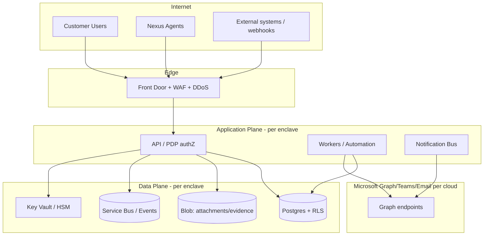
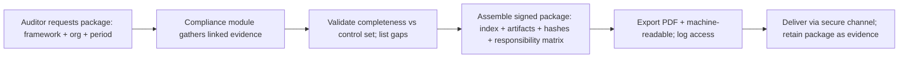

# 08 — AI, Security & Compliance (Sections P, Q, R)

---

## Section P: AI & Agent Assist

### P.1 Principles (non-negotiable)

AI is **optional, per-tenant, isolated, auditable, and off by default for sensitive/government tenants** (principle P11). No customer-visible AI output ships without human approval. No cross-tenant training. All AI usage is logged.

| Guardrail | Implementation |
|-----------|----------------|
| Per-tenant enable/disable | `feature_flags` `ai.enabled` per org; default **off** for gov/CUI tenants until contractually approved |
| No cross-tenant training | Inference-only against a model the vendor contractually does **not** train on customer data; prompts/responses never used for training; per-tenant retrieval isolation |
| Human-in-the-loop | Any **customer-visible** AI output (responses, QBR text, KB articles) requires agent approval before send/publish |
| Redaction / PII / secret detection | Pre-processing pass detects+masks PII, secrets, CUI before prompt assembly; post-processing scans output |
| Audit | `ai_interactions` records feature, model, tenant, input hash, output hash, approver, timestamp |
| Retention policy | Prompt/response retained per tenant policy (configurable, default short); never beyond tenant boundary |
| Provider strategy per cloud | Commercial: Azure OpenAI (commercial). Gov: **GovCloud-compatible model deployment** (Azure OpenAI in Azure Government, 🔍 validate availability/authorization) or AI **disabled** if no authorized model exists |

### P.2 Feature catalog

| Feature | Customer-visible? | Approval | Notes |
|---------|-------------------|----------|-------|
| Ticket summarization | No (internal) | — | Summarize long threads for agents |
| Internal note summarization | No | — | — |
| Suggested priority / category / assignment group | No | — | Triage assist; agent confirms |
| Suggested response (customer-facing) | **Yes** | **Required** | Draft only; agent edits + approves |
| KB recommendation / related/similar ticket retrieval | No | — | Retrieval over tenant-isolated index |
| Duplicate detection | No | — | Intake dedupe assist |
| Runbook recommendation | No | — | For on-call/IC |
| Posture finding summary / risk explanation | No (internal); **Yes** if shared | If shared, required | Plain-language risk |
| Executive report / QBR drafting | **Yes** | **Required** | Human finalizes |
| Natural-language search | No | — | Scoped to permitted data |
| Customer-safe response drafting + redaction | **Yes** | **Required** | Redaction enforced |

### P.3 Model abstraction layer

```text
interface AIProvider {
  capabilities(cloud): {chat, embeddings, available}
  complete(prompt, opts): result   // tenant-isolated, no-train flag enforced
  embed(text): vector
}
providers = {
  commercial: AzureOpenAICommercial,
  gov: AzureOpenAIGov | DisabledProvider   // DisabledProvider if no authorized model
}
# Selection by tenant.cloud + feature_flags.ai_enabled; DisabledProvider returns
# "AI not available in this environment" without ever calling an external service.
```

Retrieval (RAG) indexes are **per-tenant** (separate namespaces/indices), region/enclave-local; no shared vector store across orgs.

### P.4 AI threat model

| Threat | Vector | Mitigation |
|--------|--------|------------|
| Cross-tenant data leakage | Shared index/model returns another org's data | Per-tenant indices; org-scoped retrieval; output scan; deny-by-default context |
| Prompt injection | Malicious content in ticket/email steers the model | Treat all ticket content as untrusted; instruction/data separation; no tool execution from model output without human approval; output validated |
| Sensitive data egress | PII/CUI sent to model/provider | Pre-prompt redaction; gov uses in-boundary model or disabled; DLP scan |
| Hallucinated customer-facing content | Wrong info sent to customer | Mandatory human approval for customer-visible output |
| Training/retention leakage | Provider trains on data | Contractual no-train + technical no-log/zero-retention config; verify per provider |
| Model abuse / cost | Runaway calls | Per-tenant rate/cost caps; audit |
| Evidence tampering via AI | AI alters compliance text | AI output is draft; evidence artifacts remain human-attested + hashed |

---

## Section Q: Security Architecture

### Q.1 Threat model & trust boundaries



**Trust boundaries:** Internet↔Edge, Edge↔App, App↔Data, App↔Microsoft, Commercial-enclave↔Gov-enclave (no data crossing). Each boundary enforces authN, authZ, validation, and logging.

### Q.2 Attack surface & key controls

| Surface | Controls |
|---------|----------|
| Public web/API | WAF, TLS 1.2+ only, HSTS, rate limiting, OWASP protections |
| AuthN | OIDC token validation (issuer/audience/sig/exp), MFA, CA, step-up, break-glass monitoring |
| AuthZ | Central PDP, RBAC+ABAC, deny-by-default, **object-level authorization (IDOR prevention)** on every resource fetch |
| Tenant isolation | RLS + app org-guard + scoped object keys + scoped cache/queue ([02 §D.3](./02-architecture.md)) |
| File upload | Type/size validation, malware scan before availability, content disarm, stored encrypted, served via short-lived scoped URLs |
| Injection | Parameterized queries (SQLi), output encoding (XSS), SSRF allowlist on outbound (webhooks/integrations), CSRF tokens / same-site cookies |
| API | OAuth client-cred/mTLS, per-client rate limits, idempotency keys, schema validation |
| Secrets/keys | Key Vault/HSM, managed identities, certificate auth, rotation, no secrets in code/logs |
| Supply chain | SBOM, dependency/container scanning, signed builds, pinned deps, provenance |

### Q.3 Encryption & key management

| Layer | Control |
|-------|---------|
| In transit | TLS 1.2+ everywhere (incl. internal service-to-service); mTLS for sensitive internal calls |
| At rest | AES-256 on DB, blob, backups, queues |
| Key hierarchy | Platform root key (Key Vault/HSM) → per-tenant data-encryption keys → field/object keys; **per-tenant key hierarchy** enables crypto-erase on offboarding |
| BYOK/CMK | Customer-managed keys for dedicated-DB/high-sensitivity tenants; customer can revoke (renders data inaccessible) |
| Rotation | Automated key + certificate rotation; rotation events audited |

### Q.4 Secure SDLC

`threat-model → secure design review → SAST (every PR) → dependency/SCA scan → IaC scan → build (signed, SBOM generated) → container scan → DAST (staging) → deployment approval (separation of duties) → runtime monitoring`. Pen tests per release train and annually; findings tracked as posture findings/tickets.

### Q.5 Logging, audit, SIEM

- **Immutable audit logs:** append-only `audit_logs`, WORM/immutable blob, hash-chained for tamper-evidence; never editable.
- **Pervasive coverage:** every privileged action, sensitive data access, config change, auth event, consent, AI use, export.
- **SIEM export:** streamed to Microsoft Sentinel (commercial) / Sentinel in Azure Government (gov) and/or customer SIEM via secure connector; gov logs stay in gov.
- **Secure logging:** no secrets/PII/CUI in app logs (structured logging with redaction).

### Q.6 Resilience & data protection

| Concern | Target/Control |
|---------|----------------|
| HA | Multi-AZ within region; stateless app tier; managed DB with replicas |
| Multi-region / DR | Warm standby in a second region per enclave; documented failover |
| RPO / RTO | **RPO ≤ 5 min** (continuous DB backup/PITR), **RTO ≤ 1 hr** (Tier-1) |
| Backup/restore | Encrypted, geo-redundant within boundary; **restore tested** quarterly; per-tenant restore for dedicated DBs |
| DR testing | Scheduled failover exercises; evidence retained |
| Data retention/deletion | Per-tenant retention policy; certified deletion ([02 §D.8](./02-architecture.md)) |
| Legal hold / eDiscovery | Suspends deletion; auditor-scoped export |

### Q.7 Security control checklist (excerpt)

- [ ] TLS 1.2+ enforced; HSTS; no weak ciphers
- [ ] All resource fetches perform object-level authZ (IDOR test passes)
- [ ] RLS enabled on every tenant-scoped table + app org-guard fail-closed
- [ ] Attachments scanned before availability; served via scoped URLs
- [ ] Secrets only in Key Vault; managed identities used; no secrets in repo/logs (secret-scan in CI)
- [ ] SAST/DAST/SCA/IaC/container scans gating in CI
- [ ] SBOM generated + builds signed
- [ ] Audit logs immutable + SIEM export verified per enclave
- [ ] Break-glass accounts monitored; use alerts fire
- [ ] Backup restore + DR failover tested with evidence
- [ ] Rate limiting + WAF rules active; abuse alerts wired
- [ ] Per-tenant key hierarchy; CMK revocation path tested for opted tenants

---

## Section R: Compliance Architecture

### R.1 Framework coverage & responsibility split

| Framework | Use | Nexus / Customer / Shared |
|-----------|-----|----------------------------|
| NIST SP 800-53 | FedRAMP basis (Mod/High) | Platform controls (Nexus) + customer config (Shared) |
| NIST SP 800-171 | CUI protection (DIB customers) | Shared — Nexus provides controls + evidence; customer owns their environment |
| CMMC 2.0 (L1/L2) | DoD contractors | Shared; Nexus evidence supports customer assessment |
| FedRAMP Moderate/High readiness | Gov enclave authorization path | Nexus (platform) |
| SOC 2 Type II | Commercial trust | Nexus |
| ISO 27001 | ISMS | Nexus |
| CJIS | Law-enforcement customers (if applicable) | Shared (🔍 scope) |
| ITAR/EAR | Defense/export customers (if applicable) | Customer obligation; Nexus enforces gov enclave + US-person/data-boundary controls (🔍) |
| HIPAA (optional) | Healthcare customers (if applicable) | Shared; BAA + safeguards |

### R.2 Control-family mapping (representative)

| Control family (NIST 800-53) | Platform feature providing it | Evidence generated | Owner | Frequency |
|------------------------------|-------------------------------|--------------------|-------|-----------|
| AC (Access Control) | RBAC+ABAC, PDP, JIT, tenant isolation | Role assignments, access logs, JIT activations | Nexus | Continuous |
| AU (Audit & Accountability) | Immutable audit logs + SIEM | Audit export, log integrity hashes | Nexus | Continuous |
| IA (Identification & Auth) | M365 SSO, MFA, CA, step-up | Auth logs, MFA reports, CA policies (posture) | Shared | Continuous |
| CM (Config Mgmt) | CMDB, change mgmt, feature flags | Change records, CAB approvals, config snapshots | Shared | Per change |
| CP (Contingency) | Backup/DR, RPO/RTO | Restore/DR test reports | Nexus | Quarterly |
| IR (Incident Response) | Incident/MIM, on-call, PIR | Incident timelines, PIRs | Shared | Per incident |
| RA (Risk Assessment) | Posture DB, risk register, scoring | Risk register, posture snapshots, scans | Shared | Continuous |
| SC (System & Comms Protection) | Encryption, key mgmt, boundaries | Crypto config, key rotation logs | Nexus | Continuous |
| SI (System Integrity) | Malware scan, vuln mgmt, monitoring | Scan results, finding/POA&M | Shared | Continuous |
| CA (Assessment & Authorization) | POA&M, evidence packages | POA&M items, audit packages | Shared | Continuous |

(800-171 and CMMC practices map to the same features; the compliance module maintains the crosswalk per framework.)

### R.3 Compliance evidence model

Evidence is produced by operations (principle P12), typed (`consent_record`, `audit_export`, `change_record`, `posture_snapshot`, `restore_test`, `access_review`, `pir`, `deletion_certificate`, `attestation`), hashed, immutable, owner-attributed, and time-stamped. Each framework control links to the evidence types that satisfy it; gaps are visible where no evidence exists.

### R.4 Audit package workflow



**Per framework, the module reports:** relevant control families, supporting features, evidence available, evidence gaps, owner, frequency, export format, required operational procedures, and the Nexus/Customer/Shared responsibility for each control — so an assessor sees coverage and gaps in one view.
