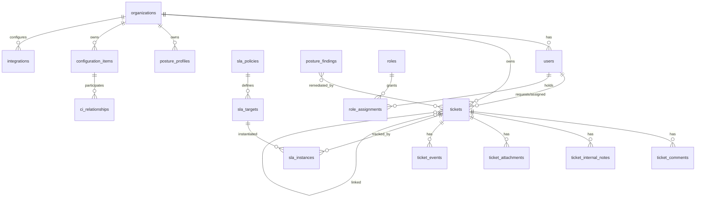

# 09 — Data Model, API & Event Architecture (Sections S, T, U)

---

## Section S: Data Architecture & Schema

### S.1 Conventions (apply to all tables)

- **PK:** `uuid` (`gen_random_uuid()`), column `id`.
- **Tenant key:** every tenant-scoped table has `organization_id uuid NOT NULL` (RLS discriminator). Nexus-global tables omit it.
- **Timestamps:** `created_at`, `updated_at timestamptz NOT NULL DEFAULT now()`; soft delete via `deleted_at`.
- **RLS:** enabled on every tenant-scoped table; policy `organization_id = current_setting('app.org_id')::uuid` (set per request from validated principal scope); Nexus cross-customer access uses an elevated role bound to `assigned_customers` + active JIT.
- **Audit:** mutations emit `audit_logs` + domain event ([Section U](#section-u-event-driven-architecture)); sensitive tables also write field-level history.
- **Encryption:** all at rest (AES-256); CUI/PII fields additionally field-encrypted with per-tenant keys; CMK for opted tenants.
- **Partitioning:** high-volume append tables (`ticket_events`, `audit_logs`, `posture_snapshot`, `notification_deliveries`, `automation_executions`) range-partitioned by month.
- **Indexes:** every FK indexed; `(organization_id, status)` composite on hot query tables; partial indexes for open/active subsets.

### S.2 Entity catalog (purpose / keys / retention / access)

| Table | Purpose | Key FKs | Partition | Retention | Encryption | Audit |
|-------|---------|---------|-----------|-----------|------------|-------|
| `organizations` | Customer tenant boundary | — | — | life of contract + legal | std (CMK opt) | yes |
| `organization_domains` | Verified domains | org | — | with org | std | yes |
| `organization_settings` | Per-org config/branding/notif rules | org | — | with org | std | yes |
| `organization_contracts` | Agreements/entitlements | org | — | contract + 7y | std | yes |
| `users` | All principals (both planes) | org? | — | with org / employment | PII-encrypted | yes |
| `user_identities` | IdP linkage (issuer/subject) | user, idp | — | with user | sensitive | yes |
| `groups` | Customer/Nexus groups | org? | — | with org | std | yes |
| `roles` | Role definitions | — | — | platform | std | yes |
| `permissions` | Permission catalog | — | — | platform | std | yes |
| `role_assignments` | Principal↔role(+scope) | user, role, org? | — | with user | std | **yes (privileged)** |
| `identity_providers` | Per-org IdP config | org | — | with org | secrets in KV | yes |
| `tickets` | Core ticket | org, requester, assignee, sla_policy | by created_at (large orgs) | contract + retention | PII fields enc | yes |
| `ticket_comments` | Customer-visible comments | ticket, author | — | with ticket | std | yes |
| `ticket_internal_notes` | Internal-only notes | ticket, author | — | with ticket | std | yes |
| `ticket_attachments` | File metadata + blob ref | ticket | — | with ticket | blob enc, scanned | yes |
| `ticket_events` | Append-only audit stream | ticket | monthly | long | std | inherent |
| `ticket_links` | Typed relations | ticket→ticket | — | with ticket | std | yes |
| `ticket_watchers` | Subscribers | ticket, user | — | with ticket | std | — |
| `ticket_custom_fields` | Field values (or jsonb on ticket) | ticket | — | with ticket | per-classification | yes |
| `ticket_forms` | Intake schemas | org? | — | platform/org | std | yes |
| `sla_policies` / `sla_targets` / `sla_instances` | SLA engine ([04](./04-sla-oncall.md)) | org/ticket | instances by month | with ticket | std | yes |
| `escalation_policies` / `escalation_steps` | Escalation | org? | — | with org | std | yes |
| `oncall_schedules` / `oncall_rotations` / `oncall_participants` / `oncall_overrides` / `oncall_acknowledgements` | On-call | team/org | acks by month | ops retention | std | yes |
| `notifications` / `notification_templates` / `notification_deliveries` | Notification ([06](./06-notifications-m365.md)) | org | deliveries by month | ops retention | std | yes |
| `integrations` / `integration_credentials` / `integration_health_checks` | M365/Graph ([06](./06-notifications-m365.md)) | org | health by month | with org | **creds in KV/cert** | yes |
| `posture_profiles` / `posture_snapshots` / `posture_findings` / `posture_controls` / `posture_evidence` / `posture_exceptions` / `posture_risks` / `poam_items` | Posture ([05](./05-posture-cmdb.md)) | org | snapshots by month | long (compliance) | evidence immutable | yes |
| `assets` / `configuration_items` / `ci_relationships` | CMDB ([05](./05-posture-cmdb.md)) | org | — | with org | std | yes |
| `services` / `service_catalog_items` | Service catalog | org? | — | with org | std | yes |
| `approvals` / `approval_steps` | Approvals | org, ticket/change | — | with subject | std | yes |
| `knowledge_articles` / `knowledge_article_versions` | KB ([07](./07-automation-kb-reporting.md)) | org? | — | with scope | std | yes |
| `automation_rules` / `automation_executions` | Automation ([07](./07-automation-kb-reporting.md)) | org? | executions by month | ops retention | std | yes |
| `audit_logs` | Immutable audit | org? | monthly | 7y+ (compliance) | WORM, hash-chained | inherent |
| `api_clients` | API credentials | org? | — | with org | secrets in KV | yes |
| `webhooks` | Outbound sinks | org | — | with org | secret in KV | yes |
| `reports` / `report_schedules` | Reporting | org? | — | with org | std | yes |
| `ai_interactions` | AI audit ([08](./08-ai-security-compliance.md)) | org | monthly | per policy (short) | hashed | inherent |
| `feature_flags` | Per-cloud/per-tenant flags | org? | — | platform | std | yes |
| `cloud_environments` | Per-cloud endpoint config | — | — | platform | std | yes |

### S.3 Core DDL (illustrative — Postgres)

```sql
CREATE TABLE organizations (
  id            uuid PRIMARY KEY DEFAULT gen_random_uuid(),
  name          text NOT NULL,
  cloud         text NOT NULL CHECK (cloud IN ('commercial','gcc','gcchigh','azgov')),
  enclave_id    text NOT NULL,
  status        text NOT NULL DEFAULT 'onboarding',
  data_boundary text NOT NULL,
  primary_idp_id uuid,
  cmk_enabled   boolean NOT NULL DEFAULT false,
  dedicated_db  boolean NOT NULL DEFAULT false,
  created_at    timestamptz NOT NULL DEFAULT now(),
  updated_at    timestamptz NOT NULL DEFAULT now(),
  deleted_at    timestamptz
);

CREATE TABLE users (
  id            uuid PRIMARY KEY DEFAULT gen_random_uuid(),
  plane         text NOT NULL CHECK (plane IN ('nexus','customer')),
  organization_id uuid REFERENCES organizations(id),   -- null for Nexus plane
  email         citext NOT NULL,
  display_name  text,
  status        text NOT NULL DEFAULT 'active',
  created_at    timestamptz NOT NULL DEFAULT now(),
  updated_at    timestamptz NOT NULL DEFAULT now(),
  UNIQUE (plane, email)
);
CREATE INDEX ix_users_org ON users(organization_id);

CREATE TABLE tickets (
  id              uuid PRIMARY KEY DEFAULT gen_random_uuid(),
  organization_id uuid NOT NULL REFERENCES organizations(id),
  ticket_number   text NOT NULL,
  type            text NOT NULL,
  requester_id    uuid REFERENCES users(id),
  affected_user_id uuid REFERENCES users(id),
  source_channel  text NOT NULL,
  category        text, subcategory text,
  service_id      uuid REFERENCES services(id),
  ci_id           uuid REFERENCES configuration_items(id),
  impact smallint, urgency smallint,
  priority        text, severity text,
  status          text NOT NULL DEFAULT 'new',
  assignment_group_id uuid REFERENCES assignment_groups(id),
  assigned_agent_id   uuid REFERENCES users(id),
  sla_policy_id   uuid REFERENCES sla_policies(id),
  response_due_at timestamptz, resolution_due_at timestamptz,
  last_customer_update_at timestamptz, last_internal_update_at timestamptz,
  tags text[], custom_fields jsonb NOT NULL DEFAULT '{}',
  parent_ticket_id uuid REFERENCES tickets(id),
  linked_posture_finding_id uuid,
  linked_change_id uuid, linked_problem_id uuid,
  resolution_code text, closure_notes text, satisfaction_score smallint,
  created_at timestamptz NOT NULL DEFAULT now(),
  updated_at timestamptz NOT NULL DEFAULT now(),
  resolved_at timestamptz, closed_at timestamptz,
  UNIQUE (organization_id, ticket_number)
);
CREATE INDEX ix_tickets_org_status ON tickets(organization_id, status);
CREATE INDEX ix_tickets_assignee ON tickets(assigned_agent_id) WHERE status NOT IN ('closed');
CREATE INDEX ix_tickets_due ON tickets(resolution_due_at) WHERE status NOT IN ('resolved','closed');

ALTER TABLE tickets ENABLE ROW LEVEL SECURITY;
CREATE POLICY tickets_isolation ON tickets
  USING (organization_id = current_setting('app.org_id', true)::uuid);
CREATE POLICY tickets_nexus_scope ON tickets
  USING (current_setting('app.plane', true) = 'nexus'
         AND organization_id = ANY (string_to_array(current_setting('app.assigned_orgs', true), ',')::uuid[]));

CREATE TABLE audit_logs (
  id          uuid DEFAULT gen_random_uuid(),
  organization_id uuid,
  actor_id    uuid, actor_plane text,
  action      text NOT NULL,
  resource_type text, resource_id uuid,
  scope       text, classification text,
  ip inet, user_agent text,
  detail      jsonb,
  prev_hash   text, row_hash text NOT NULL,   -- hash chain for tamper-evidence
  created_at  timestamptz NOT NULL DEFAULT now(),
  PRIMARY KEY (id, created_at)
) PARTITION BY RANGE (created_at);
```

(Prisma-style equivalents can be generated from these; the same conventions apply to the remaining tables in S.2.)

### S.4 Domain model overview



---

## Section T: API Architecture

### T.1 Conventions

- REST + JSON over HTTPS; resource-oriented; `/api/v1/...`. Versioned; deprecation policy with sunset headers.
- **AuthN:** Bearer (OIDC) for users; OAuth client-credentials or mTLS for `api_clients`.
- **AuthZ:** every endpoint declares a required permission; the PDP evaluates RBAC+ABAC + object-level authZ ([08 §Q.2](./08-ai-security-compliance.md)).
- **Tenant scoping:** server derives `organization_id` from principal; **never** trusts a client-supplied org for authorization (prevents IDOR/tenant confusion).
- **Pagination:** cursor-based (`?cursor=&limit=`); **Filtering:** allowlisted fields; **Sorting:** allowlisted; **Idempotency:** `Idempotency-Key` header on POST/PUT for create/mutate; **Rate limits:** per-client + per-tenant (429 + `Retry-After`).
- **Errors:** RFC 7807 problem+json; codes `400/401/403/404/409/422/429/5xx`; correlation id on every response.
- **Audit:** mutating + sensitive-read endpoints emit audit records.

### T.2 API groups (endpoint → method → permission)

| Group | Representative endpoints | Permission |
|-------|--------------------------|-----------|
| Auth/session | `POST /auth/token`, `POST /auth/stepup`, `GET /me` | public/auth |
| Organizations | `GET/POST /organizations`, `GET/PATCH /organizations/{id}` | `admin.*` / `customer.admin.*` |
| Users | `GET/POST /organizations/{id}/users`, SCIM `/scim/v2/Users` | `customer.admin.manage_users` |
| Roles | `GET /roles`, `POST /role-assignments` | `customer.admin.manage_roles` / `admin.*` |
| Tickets | `GET/POST /tickets`, `GET/PATCH /tickets/{id}`, `POST /tickets/{id}:assign|escalate|merge|resolve|reopen` | `ticket.*` |
| Comments/notes | `POST /tickets/{id}/comments`, `/internal-notes` | `ticket.comment` / internal |
| Attachments | `POST /tickets/{id}/attachments` (presigned), `GET .../{aid}` | `ticket.update` / read scope |
| SLAs | `GET/POST /sla-policies`, `GET /tickets/{id}/sla` | `sla.manage` |
| Escalations | `GET/POST /escalation-policies` | `sla.manage`/`oncall.manage` |
| On-call | `GET /oncall/schedules`, `POST /oncall/pages/{id}:ack`, `POST /oncall/overrides` | `oncall.*` |
| Notifications | `GET /notifications`, `PATCH /preferences` | self / `notification.template.manage` |
| Posture | `GET/POST /posture/findings`, `POST /posture/findings/{id}:exception`, `GET /posture/score` | `posture.*` |
| Assets/CMDB | `GET/POST /cis`, `POST /ci-relationships` | `ci.*` |
| Services | `GET /service-catalog`, `POST /service-requests` | `ticket.create` |
| Knowledge | `GET /kb/articles`, `POST /kb/articles` | `kb.*` |
| Approvals | `GET /approvals`, `POST /approvals/{id}:act` | `approval.act` |
| Automations | `GET/POST /automations`, `POST /automations/{id}:simulate|publish` | `automation.*` |
| Reports | `GET /reports`, `POST /reports/{id}:run|export` | `report.*` |
| Integrations | `GET/POST /integrations`, `POST /integrations/{id}:test`, `GET .../health` | `integration.*` |
| Webhooks | `GET/POST /webhooks` | `integration.configure` |
| Audit | `GET /audit-logs` (scoped, read-only) | `audit.read` |
| Admin | `GET/PATCH /settings`, `/feature-flags` | `feature_flag.manage` |

### T.3 OpenAPI-style example — create ticket

```yaml
POST /api/v1/tickets
summary: Create a ticket
security: [ bearerAuth ]   # permission: ticket.create
headers:
  Idempotency-Key: { required: true }
requestBody:
  application/json:
    type: object
    required: [type, subject, description]
    properties:
      type: { enum: [incident, service_request, access_request, customer_question, ...] }
      subject: { type: string, maxLength: 300 }
      description: { type: string }
      affected_user_id: { type: string, format: uuid }
      service_id: { type: string, format: uuid }
      impact: { type: integer, minimum: 1, maximum: 4 }
      urgency: { type: integer, minimum: 1, maximum: 4 }
      custom_fields: { type: object }
      attachments: { type: array, items: { $ref: '#/AttachmentRef' } }
responses:
  '201':
    body: { id, ticket_number, status, priority, response_due_at, resolution_due_at }
    headers: { Location: /api/v1/tickets/{id} }
  '403': { $ref: '#/Problem' }   # missing ticket.create or org scope
  '409': { description: Idempotency-Key replay → returns original }
  '422': { $ref: '#/Problem' }   # validation
audit: emits ticket.created + audit_log(action=ticket.create)
```

### T.4 Example — list tickets (scoped, paginated)

```http
GET /api/v1/tickets?status=in_progress&assignee=me&sort=-resolution_due_at&limit=50&cursor=...
Authorization: Bearer <token>
→ 200 { data: [ {...} ], page: { next_cursor, has_more } }
# Server scopes to principal's org/assigned_orgs; client cannot widen scope.
```

---

## Section U: Event-Driven Architecture

### U.1 Bus design

- **Backbone:** Azure Service Bus (topics/subscriptions) for commands/work + Event Grid for fan-out notifications; **per enclave** (gov bus in Azure Government). Internal **transactional outbox** pattern guarantees DB-commit↔event-publish atomicity.
- **Ordering:** per-aggregate ordering via session/partition key = `ticket_id` (or aggregate id) where order matters (status transitions); global ordering not required.
- **Idempotency:** every event has `event_id`; consumers dedupe via processed-id store/idempotency key.
- **Retry/DLQ:** exponential backoff; poison messages → DLQ + alert; DLQ drain runbook.
- **Retention:** events retained (e.g., 14–30 days on bus) + durable event log table for replay/audit; audit-relevant events also land in `audit_logs`.
- **Observability:** every publish/consume traced (correlation id), metered, and logged.

### U.2 Event catalog (name → key payload fields → ordering)

| Event | Payload (core) | Order key |
|-------|----------------|-----------|
| `organization.created` | org_id, cloud, enclave | — |
| `user.created` | user_id, org_id, plane | — |
| `ticket.created` | ticket_id, org_id, type, priority, requester_id, channel | ticket_id |
| `ticket.updated` | ticket_id, org_id, changed_fields | ticket_id |
| `ticket.assigned` | ticket_id, org_id, group_id, agent_id | ticket_id |
| `ticket.commented` | ticket_id, org_id, comment_id, visibility | ticket_id |
| `ticket.status_changed` | ticket_id, org_id, from, to | ticket_id |
| `ticket.priority_changed` | ticket_id, org_id, from, to | ticket_id |
| `ticket.escalated` | ticket_id, org_id, reason, to_target | ticket_id |
| `ticket.resolved` / `ticket.closed` / `ticket.reopened` | ticket_id, org_id, code | ticket_id |
| `sla.started` / `sla.paused` / `sla.warning` / `sla.breached` | sla_instance_id, ticket_id, org_id, metric, due_at | ticket_id |
| `oncall.page_created` / `oncall.acknowledgement_required` / `oncall.acknowledged` / `oncall.escalated` | page_id, ticket_id, schedule, responder | page_id |
| `notification.queued` / `notification.sent` / `notification.failed` | delivery_id, channel, recipient, status | delivery_id |
| `posture.finding_created` / `.finding_updated` / `.finding_remediated` | finding_id, org_id, severity | finding_id |
| `posture.exception_requested` / `.exception_approved` | exception_id, finding_id, approver | finding_id |
| `approval.requested` / `.approved` / `.rejected` | approval_id, subject_type, subject_id | approval_id |
| `change.requested` / `.approved` / `.completed` | change_id, org_id, window | change_id |
| `integration.connected` / `.failed` / `.permission_expired` | integration_id, org_id, capability | integration_id |
| `automation.executed` / `.failed` | execution_id, rule_id, version, outcome | execution_id |
| `audit.privileged_action` | actor_id, action, resource, scope | — |

### U.3 Example payload

```json
{
  "event_id": "evt_01HY...",
  "type": "sla.breached",
  "occurred_at": "2026-06-11T14:03:22Z",
  "organization_id": "org_acme",
  "enclave": "commercial",
  "data": {
    "sla_instance_id": "sla_...",
    "ticket_id": "tkt_...",
    "metric": "resolution",
    "severity": "Sev2",
    "due_at": "2026-06-11T14:00:00Z",
    "breached_at": "2026-06-11T14:03:22Z"
  },
  "idempotency_key": "sla.breached:sla_...:resolution",
  "correlation_id": "corr_...",
  "version": 1
}
```

### U.4 Consumers (representative)

| Consumer | Subscribes to | Action |
|----------|---------------|--------|
| Notification dispatcher | most events | resolve rules → send ([06](./06-notifications-m365.md)) |
| Escalation engine | `sla.warning/breached`, `oncall.*` | advance escalation/paging ([04](./04-sla-oncall.md)) |
| Automation engine | any (per rule triggers) | run workflows ([07](./07-automation-kb-reporting.md)) |
| Posture→ticket bridge | `posture.finding_created` | create remediation ticket + SLA ([05](./05-posture-cmdb.md)) |
| Audit writer | `audit.*` + sensitive events | append immutable audit |
| Analytics ETL | all | warehouse load ([07 §O.3](./07-automation-kb-reporting.md)) |
| SIEM forwarder | security/audit events | stream to Sentinel ([08 §Q.5](./08-ai-security-compliance.md)) |
