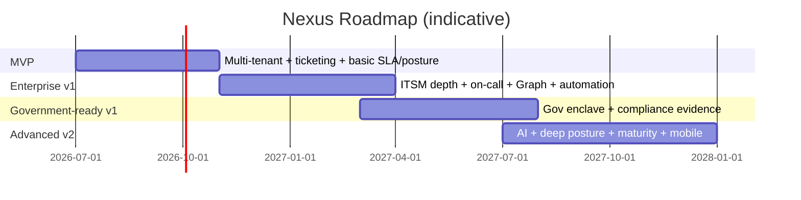

# 11 — Roadmap, Build Plan & Test Strategy (Sections Y, Z, AA)

---

## Section Y: Roadmap

Four phases. Each: **Goals · Included · Excluded · Dependencies · Risks · Acceptance · Exit.**

### Y.1 MVP — "Operate one cloud, many customers"

- **Goals:** Stand up multi-tenant ticketing with isolation, both identity planes, basic SLA + portal + audit + basic posture, on Azure Commercial only.
- **Included:** Multi-tenant org model + RLS; Nexus agent SSO; customer SSO (Entra OIDC) + magic-link fallback; ticket create/queue/assign; comments + internal notes; email notifications; basic SLA (response/resolution, business hours); basic customer portal; basic admin; audit logs; basic posture profile (manual + CSV); basic reporting (volume, SLA, aging).
- **Excluded:** On-call; Teams; Graph ingestion; automation engine; gov enclave; AI; CMDB depth; major incident/problem/change maturity.
- **Dependencies:** Azure Commercial landing zone; Nexus Entra app reg; Postgres + RLS; notification (email) adapter.
- **Risks:** RLS misconfig (tenant leakage); SLA timer accuracy; identity resolver edge cases.
- **Acceptance:** Two isolated customers; a customer user sees only own org; agent works across assigned orgs; SLA timers warn/breach correctly; every privileged action audited; tenant-isolation test suite green.
- **Exit:** Production-readiness checklist passed for commercial single-region; 2+ pilot customers live.

### Y.2 Enterprise v1 — "Full ITSM + on-call + Graph"

- **Goals:** Enterprise ITSM depth, on-call, Teams + Graph integrations, automation, customer posture dashboard, advanced reporting, SIEM export.
- **Included:** Advanced SLA (calendars/holidays/maintenance, pause/resume, update SLA); on-call rotations + escalation + paging; Teams notifications (commercial); knowledge base; service catalog; approval workflows; CMDB foundation + Graph discovery; Microsoft Graph posture ingestion; automation rules; customer posture dashboard; advanced reporting + QBR; SIEM (Sentinel) export.
- **Excluded:** Gov enclave; AI; Defender/Intune deep ingestion; mobile; advanced workflow visual builder.
- **Dependencies:** MVP; integration abstraction layer; event bus; multi-region HA.
- **Risks:** Graph throttling/consent friction; Teams variance; automation safety; on-call notification reliability.
- **Acceptance:** On-call page → ack → escalate verified; Graph consent + scoped ingestion produces findings; automation runs in simulation then production with audit; SIEM receives audit/security events; multi-region failover demonstrated.
- **Exit:** Enterprise reference customer live with on-call + posture + QBR; DR test passed.

### Y.3 Government-ready v1 — "Deployable enclave"

- **Goals:** Separate government enclave with gov identity/Graph, restricted feature matrix, compliance evidence alignment.
- **Included:** Commercial/GCC/GCC High/AzGov abstraction via `cloud_environments`; national-cloud endpoint support; gov identity configuration; restricted feature matrix + per-cloud flags; FedRAMP/NIST/CMMC evidence alignment; gov-compatible email + Teams strategy (with fallbacks); separate deployment boundary + pipeline; enhanced audit logging; compliance exports.
- **Excluded:** AI in gov (unless authorized model validated); any commercial-only connector in gov.
- **Dependencies:** Enterprise v1; Azure Government landing zone; gov Entra tenant; FedRAMP-authorized service inventory (🔍 validate each).
- **Risks:** GCC High Graph/Teams/email limits; service authorization gaps; cross-cloud B2B limits; FedRAMP cost/timeline; CMMC interpretation.
- **Acceptance:** Gov enclave deploys from same codebase; gov customer authenticates via gov authority; gov-restricted features correctly gated/fallback; audit/evidence exports produced; **no gov data leaves enclave** (validated).
- **Exit:** Gov pilot customer live in enclave; compliance evidence package generated for an assessor; ATO-readiness review passed.

### Y.4 Advanced v2 — "Intelligence + depth"

- **Goals:** AI assist, deep posture ingestion, advanced workflows, ITIL maturity, warehouse, mobile.
- **Included:** AI agent assist (commercial; gov if authorized); advanced posture ingestion; Defender/Intune integrations; visual workflow builder; major incident management; problem management maturity; change management maturity; data warehouse; customer QBR automation; mobile app; advanced on-call analytics.
- **Excluded:** —
- **Dependencies:** Enterprise v1 + Gov v1; AI provider strategy per cloud; warehouse ETL.
- **Risks:** AI data leakage; ingestion volume/cost; mobile push in gov.
- **Acceptance:** AI features per-tenant gated + audited + human-approved for customer-visible output; Defender/Intune findings flow to posture→tickets; mobile parity for core agent flows.
- **Exit:** AI adopted by ≥1 commercial customer with audit trail; warehouse powers exec analytics; mobile GA.



---

## Section Z: Build Plan

### Z.1 Epics → features

| Epic | Features |
|------|----------|
| E1 Multi-tenancy & isolation | Org model, RLS, org-guard, data boundary, enclave config |
| E2 Identity & access | Nexus SSO, customer SSO/federation, JIT/SCIM, RBAC+ABAC PDP, JIT elevation, break-glass |
| E3 Ticketing | Types, fields, lifecycle, comments/notes, attachments, links/merge, forms |
| E4 Intake | Portal, email, Teams, API, webhook, monitoring, posture, bulk |
| E5 SLA & on-call | Policies/calendars, timers, escalation, rotations, paging, MIM |
| E6 Posture | Profiles, snapshots, findings, evidence, exceptions, POA&M, scoring, ingestion |
| E7 CMDB | CIs, relationships, discovery |
| E8 Notifications | Bus, adapters, templates/branding, preferences, delivery logs |
| E9 M365 integration | Abstraction layer, Graph/Teams/email, consent, health |
| E10 Automation | Rule + visual builder, simulation, execution engine |
| E11 KB & self-service | Articles, lifecycle, search, deflection |
| E12 Reporting | Dashboards, builder, schedules, exports, QBR, warehouse |
| E13 AI assist | Provider abstraction, features, redaction, audit |
| E14 Security | AuthZ, encryption/keys, attachment scanning, SIEM, secure SDLC |
| E15 Compliance | Control mapping, evidence model, audit packages |
| E16 Platform/admin | Settings, feature flags, onboarding/offboarding, deployment/IaC |

### Z.2 Task taxonomy (per feature)

Each feature decomposes into: **Frontend** (screens/components from [Section W](./10-stack-ux-ops.md) using 21st.dev), **Backend** (API + domain + PDP), **Database** (schema/migrations/RLS/indexes), **Security** (threat review, authZ tests, scanning), **Compliance** (evidence hooks, control mapping), **DevOps** (IaC, pipeline, flags, observability), **QA** (test pyramid per [AA](#section-aa-test-strategy)), **Docs** (runbooks, API docs, admin guides), **Training** (agent/customer enablement), **UAT**, **Migration** (import tooling).

### Z.3 User story backlog (75)

Columns: **ID · Title · Persona · Story · Acceptance (abbrev) · Priority (MVP/E1/Gov/V2) · Deps · Security · Audit.**

| ID | Title | Persona | Story / Acceptance | Pri | Deps | Security | Audit |
|----|-------|---------|--------------------|-----|------|----------|-------|
| US-001 | Create org | Nexus admin | Create customer org w/ cloud+boundary → org provisioned, RLS active | MVP | E1 | org-scope guard | yes |
| US-002 | Verify domain | Nexus admin | Add+verify domain via DNS TXT → verified flag | MVP | US-001 | anti-spoof | yes |
| US-003 | Nexus SSO login | Agent | Login via Nexus Entra+MFA → session, roles mapped | MVP | E2 | token validation | auth |
| US-004 | Customer SSO login | Customer user | Login via own Entra OIDC → scoped session | MVP | US-002 | issuer/audience check | auth |
| US-005 | Magic-link fallback | Customer end user | Approved magic link → time-boxed session | MVP | E2 | rate-limit, expiry | auth |
| US-006 | Local fallback account | Customer admin | Controlled local acct + MFA when no IdP | MVP | E2 | MFA mandatory | yes |
| US-007 | RBAC role assignment | Customer org admin | Assign roles within own org → permissions applied | MVP | E2 | SoD checks | priv |
| US-008 | ABAC org scoping | Agent | Agent sees only assigned orgs → cross-org denied | MVP | E2 | deny-by-default | yes |
| US-009 | Submit ticket (portal) | End user | Submit via form+attachment → ticket created, scanned | MVP | E3,E4 | malware scan | yes |
| US-010 | Agent queue | Agent | See assigned-org queue, filter/sort/saved views | MVP | E3 | scope filter | yes |
| US-011 | Assign ticket | Agent/lead | Assign to group/agent → notified | MVP | E3,E8 | authZ | yes |
| US-012 | Comments + internal notes | Agent | Add customer comment vs internal note (hidden) | MVP | E3 | visibility enforced | yes |
| US-013 | Attachment upload+scan | User | Upload → scanned before available; infected quarantined | MVP | E14 | AV scan | yes |
| US-014 | Email notification | System | Ticket events email customer/agent (branded) | MVP | E8 | no data leak | delivery |
| US-015 | Basic SLA timers | System | Response/resolution timers warn/breach by business hours | MVP | E5 | — | sla events |
| US-016 | Audit log viewer | Auditor | Scoped, read-only audit search/export | MVP | E14 | read logged | yes |
| US-017 | Basic posture profile | Security analyst | Manual/CSV posture entry + score | MVP | E6 | posture.write | yes |
| US-018 | Basic reporting | Manager | Volume/SLA/aging dashboard | MVP | E12 | org scope | export |
| US-019 | Tenant isolation tests | Platform | Automated proof no cross-org read/write | MVP | E1 | core control | yes |
| US-020 | Email ingestion | System | Inbound email → ticket; replies thread; spoofed rejected | E1 | E4 | SPF/DKIM/DMARC | yes |
| US-021 | Shared mailbox ingest | System | Graph app-only mailbox read → tickets | E1 | E9 | least scope | yes |
| US-022 | Dedup intake | System | Duplicate emails/threads collapse | E1 | E4 | — | yes |
| US-023 | Unmatched queue | Agent | Unmapped sender → manual org assignment (no default leak) | E1 | E4 | no auto-leak | yes |
| US-024 | Advanced SLA calendars | Manager | Holidays/maintenance/24x7; pause/resume | E1 | E5 | — | sla |
| US-025 | Escalation policies | Manager | Multi-rung escalation on no-ack/breach | E1 | E5 | — | yes |
| US-026 | On-call schedule | Manager | Create rotations (primary/secondary/...) + handoff | E1 | E5 | — | yes |
| US-027 | Paging + ack | On-call | Page → ack within deadline → else escalate | E1 | E5,E8 | — | acks |
| US-028 | PTO/overrides/swaps | On-call | Override/swap with approval | E1 | E5 | approval | yes |
| US-029 | Fatigue controls | On-call | Dedup pages, quiet hours, Sev1 override | E1 | E5 | — | yes |
| US-030 | Major incident declare | IC | Declare → bridge → comms cadence → PIR | E1 | E5 | broadcast authZ | yes |
| US-031 | Teams notification | System | Post adaptive card to channel (commercial) | E1 | E9 | scope | delivery |
| US-032 | Notification preferences | User | Per-channel prefs + quiet hours | E1 | E8 | self only | yes |
| US-033 | Knowledge base | Author | Draft→review→publish, versions, search | E1 | E11 | kb perms | yes |
| US-034 | Ticket deflection | End user | Suggest KB before submit; track deflection | E1 | E11 | scope | metrics |
| US-035 | Service catalog | Admin | Catalog items + request forms + fulfillment | E1 | E3 | — | yes |
| US-036 | Approval workflow | Approver | Request needs approval → approve/reject + reason | E1 | E10 | authZ | yes |
| US-037 | CMDB CIs | Agent | Create CIs + relationships; impact view | E1 | E7 | scope | yes |
| US-038 | Graph CMDB discovery | System | Discover users/devices/licenses (delta) | E1 | E9 | least scope | yes |
| US-039 | Graph posture ingestion | Security | MFA/CA/identity posture pull → findings | E1 | E6,E9 | least scope | yes |
| US-040 | Finding→ticket | System | Confirmed finding spawns remediation ticket+SLA | E1 | E5,E6 | — | yes |
| US-041 | Exception lifecycle | Security/Compliance | Request→approve (≠requester)+expiry→reopen on expiry | E1 | E6 | SoD | yes |
| US-042 | Automation rules | Admin | Condition→action rules; simulate then publish | E1 | E10 | perm boundary | exec |
| US-043 | Customer posture dashboard | Customer security | Score/domains/trend/findings (read) + request exception | E1 | E6 | read-only | yes |
| US-044 | Advanced reporting + QBR | CSM | Build/schedule reports; QBR package | E1 | E12 | scope | export |
| US-045 | SIEM export | Security | Audit/security events → Sentinel | E1 | E14 | secure conn | yes |
| US-046 | Integration health + test | Ops | Health dashboard + live test button | E1 | E9 | — | yes |
| US-047 | Consent evidence capture | System | Admin consent → immutable consent record | E1 | E9,E15 | — | yes |
| US-048 | Multi-region failover | Platform | DR failover within RTO/RPO | E1 | E14 | — | yes |
| US-049 | Cloud env config | Platform | Per-cloud endpoints as data, not code | Gov | E9 | — | yes |
| US-050 | Gov enclave deploy | Platform | Same codebase deploys to Azure Gov, separate pipeline | Gov | E16 | boundary | yes |
| US-051 | Gov identity authority | Customer (gov) | Auth via login.microsoftonline.us | Gov | E2,E9 | issuer check | auth |
| US-052 | National-cloud Graph | System | graph.microsoft.us endpoints used in gov | Gov | E9 | validate | yes |
| US-053 | Restricted feature matrix | Platform | Per-cloud flags gate Teams/SMS/AI | Gov | E9 | — | yes |
| US-054 | Gov email strategy | System | Graph Mail.Send (gov mailbox) or relay; portal floor | Gov | E8,E9 | validate | delivery |
| US-055 | Teams fallback (gov) | System | Teams unavailable → email+portal, logged | Gov | E8 | — | delivery |
| US-056 | Enhanced gov audit | Compliance | Expanded audit fields + immutable storage | Gov | E14 | WORM | yes |
| US-057 | Compliance control map | Compliance | Features ↔ NIST/CMMC controls crosswalk | Gov | E15 | — | yes |
| US-058 | Evidence package export | Auditor | Assemble signed audit package per framework | Gov | E15 | signed | yes |
| US-059 | No-egress validation | Security | Prove gov data never leaves enclave | Gov | E14 | core control | yes |
| US-060 | CMK/BYOK | Customer admin | Customer key for dedicated-DB tenant; revoke path | Gov | E14 | key mgmt | yes |
| US-061 | Data export (offboard) | Nexus admin | Full org export package (JSON+PDF+attachments) | Gov | E16 | scope | yes |
| US-062 | Certified deletion | Nexus admin | Crypto-erase + deletion certificate | Gov | E14,E16 | — | yes |
| US-063 | Legal hold | Compliance | Place/release hold; blocks deletion | Gov | E15 | — | yes |
| US-064 | AI provider abstraction | Platform | Provider per cloud; DisabledProvider in gov default | V2 | E13 | no egress | yes |
| US-065 | Ticket summarization | Agent | AI summarizes thread (internal) | V2 | E13 | redaction | ai |
| US-066 | Suggested triage | T1 | AI suggests priority/category/group; agent confirms | V2 | E13 | logged | ai |
| US-067 | Customer-safe response draft | Agent | AI drafts reply; human approves before send | V2 | E13 | approval gate | ai |
| US-068 | Duplicate detection (AI) | System | Similar-ticket retrieval at intake | V2 | E13 | tenant-isolated | ai |
| US-069 | Defender ingestion | Security | Endpoint/vuln findings → posture | V2 | E6,E9 | least scope | yes |
| US-070 | Intune ingestion | Security | Device/compliance/patch posture | V2 | E6,E9 | least scope | yes |
| US-071 | Visual workflow builder | Admin | DAG builder w/ branching+gates+rollback | V2 | E10 | perm boundary | exec |
| US-072 | Problem management | Problem mgr | Problems, RCA, known-error KB | V2 | E3 | — | yes |
| US-073 | Change management maturity | Change mgr | CAB classes, calendar, SoD enforced | V2 | E3 | SoD | yes |
| US-074 | Data warehouse + BI | Exec | Nightly ETL (per enclave) → BI dashboards | V2 | E12 | scope | yes |
| US-075 | Mobile app | Agent/on-call | Core ticket + ack flows on mobile | V2 | E3,E5 | device trust | yes |

(Backlog is extensible; each story expands into the Z.2 task taxonomy with full acceptance criteria in the tracker.)

---

## Section AA: Test Strategy

### AA.1 Test pyramid & types

| Layer | Scope | Tooling (indicative) | Gate |
|-------|-------|----------------------|------|
| Unit | Domain logic (SLA calc, priority matrix, scoring, PDP) | Jest/Vitest, Go test | every PR |
| Integration | API + DB + RLS + bus | Testcontainers (Postgres), contract tests | every PR |
| API | Endpoint contract, authZ, pagination, idempotency | Supertest + OpenAPI validation | every PR |
| UI | Component + screen behavior, states | React Testing Library, Storybook | every PR |
| E2E | Critical journeys (submit→resolve, page→ack, finding→ticket) | Playwright | pre-merge/nightly |
| Load | Throughput, latency SLOs | k6 | pre-release |
| Soak | Stability over time, leak detection | k6/long-run | pre-release |
| Chaos | Fault injection (DB failover, bus DLQ, dependency down) | Azure Chaos Studio | pre-release |
| Security | SAST/DAST/SCA/IaC/secret-scan; pen test | CodeQL, ZAP, Trivy, gitleaks | CI gate + per release |
| Accessibility | WCAG 2.1 AA / 508 | axe + manual | every PR (axe), per release (manual) |
| Cross-browser | Chrome/Edge/Firefox/Safari | Playwright matrix | per release |
| Gov-cloud integration | Endpoints/feature matrix in gov | targeted suite in gov enclave | per gov release |
| Identity federation | Multi-IdP, multi-cloud authorities | scripted IdP harness | per release |
| Tenant isolation | No cross-org access (read/write/cache/blob/notify) | dedicated suite | CI gate (blocking) |
| RBAC/ABAC | Permission matrix coverage | policy test suite | CI gate |
| SLA calc | Calendars/DST/pause-resume/breach idempotency | property + table tests | CI gate |
| On-call escalation | No-ack→escalate, fatigue, overrides | scenario tests | per release |
| Notification delivery | Channel routing, fallback, retry, DLQ | integration tests | per release |
| Backup/restore | PITR + per-tenant restore | scheduled drill | quarterly |
| DR | Region failover within RTO/RPO | scheduled drill | quarterly |
| Audit evidence | Events produce expected audit + evidence | assertion suite | CI + per release |

### AA.2 Sample test cases

```text
TC-ISO-01 (Tenant isolation — blocking)
  Given agent assigned only to org_acme
  When GET /tickets?organization_id=org_beta (or any beta resource by id)
  Then 403/404; no beta row returned; attempt audited.

TC-ISO-02 (RLS direct)
  With app.org_id=org_acme set, SELECT * FROM tickets returns only acme rows,
  even for a query lacking an explicit org predicate (RLS enforces).

TC-SLA-01 (Business-hours breach)
  Calendar 8x5 America/New_York; ticket opened Fri 16:00; resolution target 4h.
  Then due = Mon 12:00 (skips weekend); warning at 75% consumed; breach fires once.

TC-SLA-02 (Pause/resume + DST)
  Ticket waiting_customer over a DST change and a holiday.
  Then paused time excluded; due recomputed correctly across DST; single breach event.

TC-OC-01 (No-ack escalation)
  Sev1 page to primary; no ack in 5m.
  Then secondary paged via escalated channels; MTTA recorded; if none ack → manager/IC.

TC-IDOR-01 (Object-level authZ)
  Customer end user requests GET /tickets/{other_users_ticket_in_same_org}.
  Then 403 (read.own only); access attempt audited.

TC-INTAKE-01 (Spoof rejection)
  Inbound email failing DMARC for a verified domain.
  Then quarantined, not converted to ticket; ops alerted; audited.

TC-AI-01 (Customer-visible gate)
  AI drafts a customer response.
  Then it is NOT sent until an agent approves; approval + AI interaction audited.

TC-GOV-01 (No egress)
  In gov enclave, trigger AI + Teams + email.
  Then AI uses gov/disabled provider; Teams falls back to email+portal; no call leaves
  the gov boundary (network assertion); substitutions logged.

TC-EVID-01 (Evidence on consent)
  Customer admin grants admin consent.
  Then immutable consent_record created with admin UPN, scopes, tenant, cloud, time;
  appears in audit package for AC/CM controls.

TC-DR-01 (Failover)
  Force primary-region DB failover.
  Then app recovers within RTO; data loss within RPO; no cross-tenant bleed post-failover.
```

### AA.3 Quality gates (CI)

Blocking: unit/integration/API/UI green; tenant-isolation + RBAC/ABAC + SLA suites green; SAST/SCA/secret-scan/IaC clean (no high/critical); axe no critical violations; OpenAPI contract valid; migrations reversible. Non-blocking-but-tracked: load/soak/chaos trends, manual a11y, pen-test findings (tracked as posture findings).
