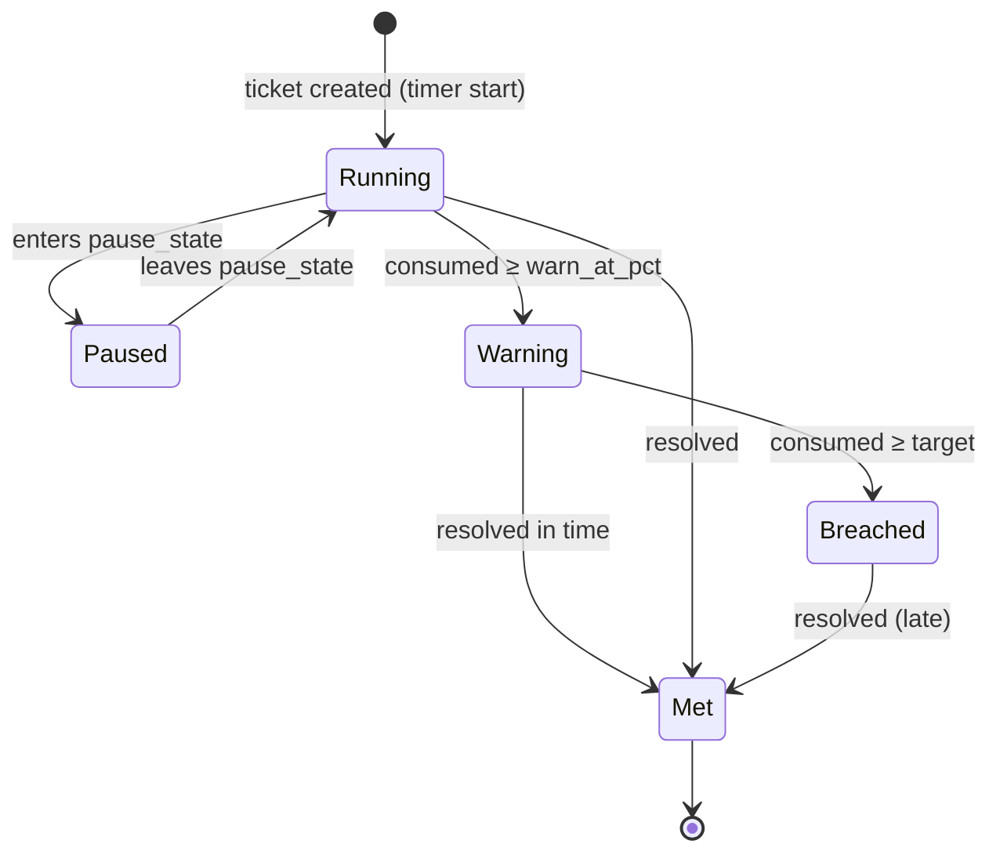
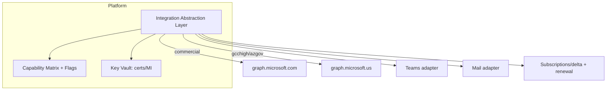
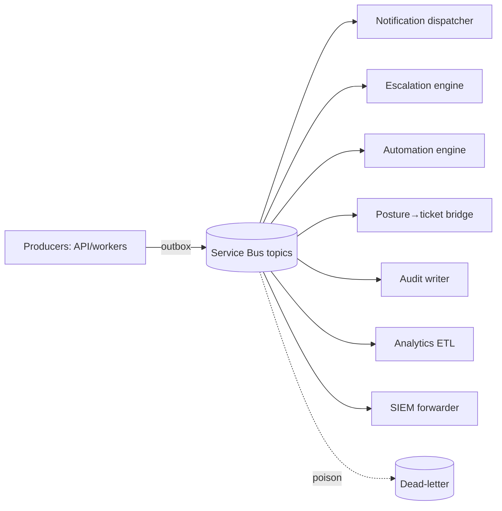

# 12 — Risk Register, ADRs & Diagrams (Sections AB, AC, AD)

---

## Section AB: Risk Register

Severity = Likelihood × Impact (L/M/H). Residual = after mitigation.

| ID | Risk | Category | Likeli. | Impact | Sev | Owner | Mitigation | Detection | Contingency | Residual |
|----|------|----------|---------|--------|-----|-------|-----------|-----------|-------------|----------|
| R-01 | Identity complexity (many IdPs/clouds) causes misrouting/lockout | Identity | H | H | **H** | Identity Lead | Per-cloud authorities as data; resolver tests; fallbacks; staged onboarding | Login error rates, support tickets | Magic-link/local fallback; manual IdP fix | M |
| R-02 | GCC High integration limitations break features | Gov | H | H | **H** | Gov Architect | Capability matrix + flags; validate per tenant; alternates | Integration health checks | Disable feature, portal/email fallback | M |
| R-03 | Azure Gov email sending limits/blocks | Gov | M | H | **H** | Gov Architect | Graph gov mailbox / authorized relay; portal floor | Delivery logs/failures | Switch send path; portal notify | M |
| R-04 | Teams notification limits in gov | Gov | H | M | **M** | Notif Lead | Teams as enhancement only; email+portal default | Delivery substitution logs | Auto-fallback chain | L |
| R-05 | Graph admin-consent friction / revocation | Integration | M | H | **H** | Integration Lead | Per-customer app reg, least scope, clear consent UX, evidence | Consent/permission-expired events | Re-consent workflow; degrade gracefully | M |
| R-06 | Customer tenant onboarding friction | Ops | M | M | **M** | CSM Lead | Onboarding wizard; checklist; templates | Onboarding cycle time | Hands-on assisted onboarding | L |
| R-07 | Multi-tenant data leakage | Security | L | **Critical** | **H** | Security Lead | RLS + app org-guard + scoped keys + isolation test gate | Isolation tests, anomaly detection, access audits | Incident response, customer notify, contain | L |
| R-08 | RBAC/ABAC misconfiguration | Security | M | H | **H** | Security Lead | Policy-as-data, test matrix, deny-by-default, reviews | AuthZ test failures, audit review | Tighten policy, revoke, audit sweep | M |
| R-09 | SLA timer inaccuracies | Product | M | M | **M** | Eng Lead | tz/DST handling, idempotent events, nightly reconcile | Reconciliation diffs | Recompute, credit SLA, notify | L |
| R-10 | On-call notification failure | Ops | M | H | **H** | SRE Lead | Multi-channel escalation, retries, delivery confirmation, escalate-on-fail | Page delivery confirmations | Manual escalate; backup responder | M |
| R-11 | Alert fatigue | Ops | H | M | **M** | SRE Lead | Dedup, suppression, quiet hours, rate caps | On-call burden metrics | Tune thresholds; rebalance rotations | L |
| R-12 | Compliance scope creep | Compliance | M | M | **M** | Compliance Lead | Defined framework scope per customer; change control | Scope vs evidence gaps | Re-baseline scope; contract amend | M |
| R-13 | FedRAMP cost/timeline | Business | M | H | **H** | Exec Sponsor | Phased gov readiness; reuse authorized services; partner | Program milestones | Re-sequence; 3PAO engagement | M |
| R-14 | CMMC interpretation differences | Compliance | M | M | **M** | Compliance Lead | Map to practices conservatively; RPO/C3PAO guidance | Assessment feedback | Adjust controls/evidence | M |
| R-15 | AI data leakage / cross-tenant | AI/Security | L | H | **M** | AI Lead | Per-tenant indices, no-train, redaction, gov-disabled default | AI audit, output scans | Disable AI, rotate, notify | L |
| R-16 | Attachment malware | Security | M | H | **H** | Security Lead | Scan-before-available, quarantine, content disarm | Scanner hits | Quarantine, purge, notify | L |
| R-17 | Email spoofing into intake | Security | M | M | **M** | Security Lead | SPF/DKIM/DMARC enforcement, known-domain check | DMARC failures | Quarantine; tighten rules | L |
| R-18 | Integration throttling (Graph 429) | Integration | H | M | **M** | Integration Lead | Backoff, delta queries, jittered fleet polls, caps | 429 rates | Slow polls; prioritize critical | L |
| R-19 | Data residency violation | Gov/Compliance | L | **Critical** | **H** | Gov Architect | Enclave separation, region pinning, no-egress tests | Egress monitoring | Contain, report, remediate | L |
| R-20 | Backup/restore failure | Ops | L | H | **M** | SRE Lead | PITR, geo-redundant, quarterly restore drills | Restore drill results | Failover to replica; vendor escalation | L |
| R-21 | Reporting inaccuracies | Product | M | M | **M** | Data Lead | Metrics from audited events, reconcile, versioned defs | Metric diffs | Recompute; annotate corrections | L |
| R-22 | Customer offboarding (data handling) | Ops/Compliance | M | H | **H** | Compliance Lead | Governed offboarding, export+certified deletion, hold checks | Offboarding checklist | Re-run deletion; certificate | L |
| R-23 | Audit evidence gaps | Compliance | M | H | **H** | Compliance Lead | Evidence-as-exhaust, completeness checks per control | Gap report in package | Backfill evidence; document | M |
| R-24 | Vendor lock-in (Azure) | Architecture | M | M | **M** | Architect | Interface abstraction (storage/bus/secrets/identity/AI), portable build | Coupling reviews | Swap impl behind interface | M |
| R-25 | Operational support burden | Ops/Business | M | M | **M** | Service Desk Mgr | Automation, KB deflection, tiering, capacity planning | Workload/backlog metrics | Staff up; automate; reprioritize | M |

---

## Section AC: Architecture Decision Records

Each ADR: **Status · Context · Decision · Alternatives · Consequences · Security · Compliance.**

### ADR-001 Multi-tenant architecture
- **Status:** Accepted. **Context:** MSP serving many isolated customers + Nexus cross-customer ops + gov boundary. **Decision:** Hybrid — shared DB + RLS by default, dedicated DB for flagged/high-sensitivity tenants, separate gov enclave; app-layer org-guard in addition to RLS. **Alternatives:** pure shared (weak isolation), pure per-tenant DB (ops overhead), per-customer app instances (no cross-customer ops). **Consequences:** efficient + isolated; two backup/migration paths. **Security:** belt-and-suspenders isolation. **Compliance:** enclave + CMK supports FedRAMP/CUI.

### ADR-002 Identity provider strategy
- **Status:** Accepted. **Context:** two planes, many customer IdPs across clouds. **Decision:** Nexus Entra (single-tenant, per-enclave) for agents; customer IdP federation (OIDC/SAML/B2B/External ID) + fallbacks; per-cloud authorities as data. **Alternatives:** one shared IdP for all (won't fit gov/customer reality). **Consequences:** flexible; resolver complexity. **Security:** strict token validation, issuer pinning. **Compliance:** IA controls, consent evidence.

### ADR-003 Government cloud abstraction
- **Status:** Accepted. **Context:** commercial vs GCC/GCC High/AzGov differences. **Decision:** single codebase + `cloud_environments` + `feature_flags` + integration abstraction + capability matrix; separate gov deployment. **Alternatives:** forked gov product (maintenance burden), third-party gov host. **Consequences:** one product, config-driven variance. **Security:** no commercial dependency on gov critical path. **Compliance:** data boundary, ATO path.

### ADR-004 Database choice
- **Status:** Accepted. **Decision:** PostgreSQL (Azure Flexible Server) for RLS, jsonb, partitioning, maturity, gov availability. **Alternatives:** Azure SQL (RLS yes, but Postgres jsonb/extensions preferred), NoSQL (weak relational/transactional needs). **Consequences:** strong relational + isolation. **Security:** RLS. **Compliance:** PITR, encryption, CMK.

### ADR-005 Event bus choice
- **Status:** Accepted. **Decision:** Azure Service Bus (ordering/DLQ/sessions) + Event Grid (fan-out), transactional outbox. **Alternatives:** Kafka (heavier ops, gov parity work), direct calls (no decoupling). **Consequences:** reliable async, gov parity. **Security:** per-enclave bus. **Compliance:** auditable events.

### ADR-006 Notification architecture
- **Status:** Accepted. **Decision:** event-driven dispatcher + per-cloud adapters + fallback chain (Teams→Email→Portal); portal is the floor. **Alternatives:** direct channel calls (no fallback, cloud-fragile). **Consequences:** resilient, gov-safe. **Security:** no recipient leakage. **Compliance:** delivery logs as evidence.

### ADR-007 Microsoft Graph integration model
- **Status:** Accepted. **Decision:** abstraction layer, per-cloud endpoints, least-scope app perms, certificate/managed-identity auth, delta + throttling handling, consent evidence. **Alternatives:** ad-hoc SDK calls (cloud-fragile, over-scoped). **Consequences:** secure, portable. **Security:** minimized scopes, secretless. **Compliance:** consent records, AC/CM.

### ADR-008 Email ingestion model
- **Status:** Accepted. **Decision:** per-org inbound address; Graph mailbox read (or gov relay); DMARC enforcement; threading via correlation token. **Alternatives:** single shared inbox (mapping ambiguity), POP/IMAP (weak security). **Consequences:** reliable mapping. **Security:** anti-spoof, scan. **Compliance:** auditable intake.

### ADR-009 Teams notification model
- **Status:** Accepted. **Decision:** Teams as enhancement channel via Graph channel post/Adaptive Cards where validated; never sole channel; gov gated. **Alternatives:** incoming webhooks (deprecating, gov-limited), bot-only (gov availability). **Consequences:** works across clouds with fallback. **Security:** scoped. **Compliance:** substitution logging.

### ADR-010 Posture database as core domain
- **Status:** Accepted. **Decision:** posture is a first-class system-of-record linked to tickets/SLA/evidence, not a reporting add-on. **Alternatives:** bolt-on GRC, generic security tickets. **Consequences:** integrated remediation + evidence. **Security:** drives security ops. **Compliance:** RA/CA/SI evidence native.

### ADR-011 SLA engine design
- **Status:** Accepted. **Decision:** single SLA engine (policies/targets/instances), business-calendar-aware, idempotent warning/breach events, nightly reconcile, serves all ticket types incl. posture remediation. **Alternatives:** per-module timers (drift, duplication). **Consequences:** one source of truth. **Security:** n/a. **Compliance:** auditable SLA evidence.

### ADR-012 On-call engine design
- **Status:** Accepted. **Decision:** integrated on-call (rotations/escalation/paging) sharing severity model with ITSM + MIM; multi-channel with fatigue controls. **Alternatives:** separate paging vendor (cost, second source of truth, gov gaps). **Consequences:** unified incident flow. **Security:** scoped paging. **Compliance:** ack/timeline evidence.

### ADR-013 Audit logging strategy
- **Status:** Accepted. **Decision:** append-only, hash-chained `audit_logs` to immutable/WORM storage, pervasive coverage, SIEM export per enclave. **Alternatives:** mutable app logs (tamperable). **Consequences:** tamper-evident trail. **Security:** integrity. **Compliance:** AU controls, audit packages.

### ADR-014 AI enablement strategy
- **Status:** Accepted. **Decision:** optional, per-tenant, off-by-default for sensitive/gov, provider abstraction (gov-authorized or DisabledProvider), no cross-tenant training, redaction, human approval for customer-visible output, full audit. **Alternatives:** always-on AI (privacy/gov risk), no AI (lost value). **Consequences:** safe optionality. **Security:** AI threat model controls. **Compliance:** auditable, boundary-respecting.

### ADR-015 Deployment model
- **Status:** Accepted. **Decision:** containerized on AKS, IaC (Bicep/Terraform), per-enclave independent pipelines, blue/green + canary, expand-contract migrations; portable build option. **Alternatives:** PaaS-only (less control), single pipeline for all clouds (boundary risk). **Consequences:** repeatable, isolated. **Security:** signed builds, SBOM. **Compliance:** change control, separation.

### ADR-016 CMDB model
- **Status:** Accepted. **Decision:** typed CIs + relationships + discovery (Graph/Intune/Azure/CSV/API), linked to tickets/changes/findings, feeds asset posture. **Alternatives:** flat asset list (no impact analysis), external CMDB (integration overhead). **Consequences:** impact/blast-radius analysis. **Security:** scoped. **Compliance:** CM evidence.

---

## Section AD: Diagrams

> Domain-specific diagrams live in their sections; this is the consolidated set.

### AD.1 System context
```mermaid
graph TB
  CU[Customer Users] --> FD[Front Door + WAF]
  NU[Nexus Agents] --> FD
  EXT[External systems / monitoring] --> FD
  FD --> APP[Nexus Platform (per enclave)]
  APP --> MS[Microsoft Graph / Teams / Email (per cloud)]
  APP --> SIEM[Sentinel / Customer SIEM]
  APP --> DB[(Postgres + RLS)]
  APP --> BLOB[(Evidence/Attachments WORM)]
```

### AD.2 Multi-tenant architecture — see [02 §D.1](./02-architecture.md)
### AD.3 Identity flow — see [02 §E.7](./02-architecture.md)
### AD.4 Ticket lifecycle — see [03 §F.5](./03-ticketing.md)

### AD.5 SLA lifecycle


### AD.6 On-call escalation — see [04 §H.9](./04-sla-oncall.md)

### AD.7 Posture finding → ticket workflow
```mermaid
flowchart LR
  ING[Ingestion: Graph/Defender/Intune/manual] --> SNAP[Snapshot + score]
  SNAP --> RULE{Threshold/rule}
  RULE -->|breach| F[Create posture_finding]
  F --> REV[Analyst review]
  REV -->|confirmed| TKT[Create remediation ticket + remediation SLA]
  TKT --> REM[Remediate + evidence]
  REM --> VER[Verify + close finding]
  REV -->|accept risk| EXC[Exception (approver ≠ requester, expiry)]
  EXC --> RPT[Posture score + QBR + audit package]
  VER --> RPT
```

### AD.8 Microsoft integration architecture


### AD.9 Event-driven architecture


### AD.10 Deployment architecture
```mermaid
graph TB
  subgraph Commercial Enclave (Azure Commercial)
    FDc[Front Door/WAF] --> AKSc[AKS]
    AKSc --> PGc[(Postgres HA)]
    AKSc --> RDc[(Redis)]
    AKSc --> SBc[(Service Bus)]
    AKSc --> BLc[(Blob WORM)]
    AKSc --> KVc[Key Vault/HSM]
    AKSc --> SENc[Sentinel]
  end
  subgraph Government Enclave (Azure Government)
    FDg[Front Door/WAF] --> AKSg[AKS]
    AKSg --> PGg[(Postgres HA)]
    AKSg --> SBg[(Service Bus)]
    AKSg --> BLg[(Blob WORM)]
    AKSg --> KVg[Key Vault/HSM]
    AKSg --> SENg[Sentinel Gov]
  end
  CICD[CI/CD: signed artifacts] -->|promote w/ approval| FDc
  CICD -->|separate gov pipeline| FDg
```

### AD.11 Data model overview — see [09 §S.4](./09-data-api-events.md)

### AD.12 Notification workflow — see [06 §K.6](./06-notifications-m365.md)
