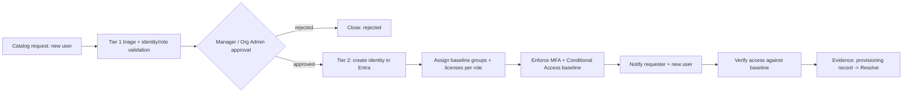
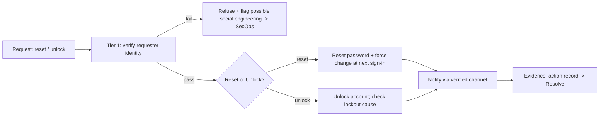
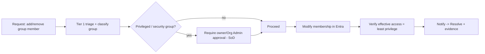
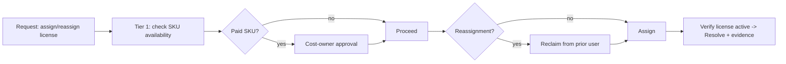
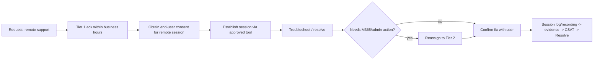
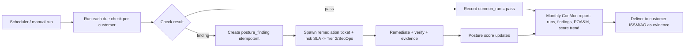

# Service-Desk Workflows & Processes (Lite Helpdesk)

> Scope: the in-scope managed helpdesk activities plus **Continuous Monitoring (ConMon)**.
> These workflows are implemented in the platform as a **service catalog** with
> fulfillment task-checklists, approvals, SLAs, tier routing, and evidence — see
> `apps/api/src/modules/catalog.ts`, `conmon.ts`, the `service_catalog_items` /
> `service_request_tasks` / `conmon_checks` tables, and the `/catalog` UI.

---

## 1. Operating model — support tiers

The Lite Helpdesk runs a **tiered model**. Each tier owns specific request types and is the
escalation target for the tier below it.

| Tier / Role | Owns | Escalates to |
|-------------|------|--------------|
| **Tier 1 — Helpdesk Analyst** | Intake, acknowledgement, severity triage, routine actions (password reset, unlock, group change, license assignment), customer communication | Tier 2 (M365 Admin) or SecOps |
| **Tier 2 — M365 Administrator** | Onboarding/offboarding execution, baseline-driven provisioning, complex account/license actions, runbook execution | Engagement Manager / SecOps |
| **Security Operations (SecOps)** | Security-incident, outage, phishing, risky-sign-in triage (24×7); IR coordination; automation pause/hold | ISSM / AO + Engagement Manager |
| **Engagement Manager** | SLA ownership, executive escalation, scope/billing decisions, customer relationship | Customer ISSM / AO / exec sponsor |
| **ISSO / ISSM / AO (Customer)** | Risk acceptance, authorization oversight, security decisions | — |

### 1.1 Single accountable owner (non-negotiable)

> **Every ticket has exactly one assignee at all times.** Escalation **REASSIGNS ownership and
> notifies** — it never simply CCs a higher tier while leaving the ticket unowned.

Platform enforcement:
- `tickets.assigned_agent_id` (and owning `assignment_group_id`) is **always set** after triage.
- The **escalate** action (`POST /tickets/:id/escalate`) performs a *reassignment*: it moves
  ownership to the escalation target tier's group, records a `ticket_events` escalation entry
  (from-owner → to-owner), emits `ticket.escalated`, and notifies both parties. It refuses to
  leave a ticket unassigned.
- Re-assignment is audited (`audit_logs`, action `ticket.escalate`) with the prior and new owner.

### 1.2 Tier ↔ platform roles / groups

| Tier | Assignment group (seeded) | Platform roles |
|------|---------------------------|----------------|
| Tier 1 | `Tier 1 — Helpdesk Analyst` | `Tier1` |
| Tier 2 | `Tier 2 — M365 Administrator` | `Tier2`, `Tier3` |
| SecOps | `Security Operations` | `SecurityAnalyst` |
| Engagement Manager | `Engagement Management` | `ServiceDeskManager` |
| Customer ISSM/AO | (customer-side approver) | `OrgAdmin`, `SecurityContact` |

---

## 2. Common conventions (apply to every workflow)

| Aspect | Convention |
|--------|-----------|
| Intake | Customer portal **Service Catalog** item, agent-created, or email. Each item has a typed form. |
| Identity verification | Account-affecting requests require requester identity verification (anti–social-engineering) before action. |
| Approval | Catalog item declares `requires_approval` + approver role. Approval is a gate before fulfillment. |
| Ownership | Routed to the **owning tier group**; one accountable owner picks it up; escalation reassigns. |
| Fulfillment | Catalog item declares ordered **fulfillment steps** → generated as `service_request_tasks`; the owner completes each, some are automatable. |
| SLA | Response + resolution targets per item (business-hours aware); breach → escalate per tier. |
| Automation | `automatable` steps may be executed by the automation engine (human-in-the-loop for customer-visible/destructive actions). |
| Evidence | Each completed request emits an evidence record (who/what/when) supporting AC/CM/AU controls. |
| Audit | Every state change, approval, task completion, and escalation is audited. |
| Closure | Ticket resolves only when all fulfillment tasks are done (or explicitly skipped with reason) and CSAT requested. |

---

## 3. Workflows

### 3.1 User creation & provisioning (per established baselines)

- **Catalog key:** `user.provisioning` · **Type:** access_request · **Owning tier:** Tier 2 (M365 Admin) · **Intake/triage:** Tier 1 · **Approval:** required (Customer manager / Org Admin) · **SLA:** response 1h, resolution 8 business hrs.
- **Intake fields:** full name, work email/UPN, role/baseline, department, manager, start date, required apps.
- **Security:** least-privilege **baseline** drives group/license/CA assignment; no standing admin; MFA enforced at first sign-in.



- **Automatable steps:** create identity, assign baseline groups/licenses (Graph), enforce CA — proposed by automation, executed on approval.

### 3.2 Deprovisioning & offboarding (license reclamation, access revocation)

- **Catalog key:** `user.offboarding` · **Type:** access_request · **Owning tier:** Tier 2; **SecOps** notified for risk · **Approval:** required (HR/manager + SecOps for risky exits) · **SLA:** response 30m, resolution 4h (security-sensitive).
- **Security:** **timely revocation** to limit insider risk; **legal-hold check** before data actions; sessions/tokens revoked immediately.

```mermaid
flowchart LR
  A[Catalog request: offboard user] --> B[Tier 1 triage + verify authorization]
  B --> C{Manager/HR approval (+ SecOps if risky)}
  C -->|approved| D[Disable account + revoke sessions/tokens]
  D --> E[Remove group memberships + admin roles]
  E --> F[Reclaim licenses]
  F --> G{Legal hold?}
  G -->|hold| H[Preserve mailbox/data; skip deletion]
  G -->|none| I[Convert/forward mailbox per policy]
  H --> J[Evidence: revocation + reclamation record]
  I --> J
  J --> K[Notify stakeholders -> Resolve]
```

- **Escalation:** suspected malicious exit / data exfiltration → reassign to **SecOps** (IR).

### 3.3 Password resets & account unlocks

- **Catalog keys:** `account.password_reset`, `account.unlock` · **Type:** service_request · **Owning tier:** Tier 1 · **Approval:** none (identity-verified) · **SLA:** response 15m, resolution 1h.
- **Security:** **mandatory identity verification** (step-up / approved verification) before action — primary control against social-engineering; force change at next sign-on; re-register MFA if compromised.



- **Escalation:** repeated lockouts / suspected compromise → reassign to **SecOps** (risky sign-in).

### 3.4 Group membership changes

- **Catalog key:** `group.membership_change` · **Type:** access_request · **Owning tier:** Tier 1 (standard) / Tier 2 (complex) · **Approval:** required **only for privileged/security groups** (SoD) · **SLA:** resolution 4 business hrs.
- **Security:** privileged group changes require approval + audit; verify **least privilege**; separation of duties (requester ≠ approver).



### 3.5 Basic license assignment & reassignment

- **Catalog key:** `license.assignment` · **Type:** service_request · **Owning tier:** Tier 1 · **Approval:** required for **paid SKUs / cost owner**; auto for free · **SLA:** resolution 4 business hrs.
- **Security/Cost:** verify availability; on **reassignment**, reclaim from prior user; avoid over-licensing.



### 3.6 Remote support during business hours

- **Catalog key:** `support.remote_session` · **Type:** incident · **Owning tier:** Tier 1 (→ Tier 2 if M365/admin) · **Approval:** **end-user consent** for the remote session · **SLA:** response 30m (business hours), resolution per issue.
- **Security:** approved remote tool only; **explicit consent**; session **logged/recorded** as evidence; business-hours only unless escalated to on-call.



---

## 4. ConMon — Continuous Monitoring process

ConMon is the **proactive, scheduled** security/compliance monitoring program (aligned to NIST
SP 800-137 / FedRAMP continuous monitoring). Unlike the reactive catalog requests above, ConMon
**runs on a cadence**, generates findings into the **posture database**, drives remediation
**tickets with SLA**, and produces a **monthly ConMon report** as compliance evidence.

- **Owning tier:** SecOps (with Tier 2 for remediation execution; ISSM/AO for risk acceptance).
- **Implementation:** `conmon_checks` (the catalog of checks + cadence), a scheduler
  (`startConMonScheduler`) + manual trigger (`POST /conmon/run`), and `conmon_runs` (history).
  A failing check creates a `posture_finding` (idempotent), which can become a remediation
  ticket with a risk-based SLA (Critical 7d / High 30d / Moderate 90d).

### 4.1 Check catalog (cadence)

| Check | Domain | Cadence | Control refs (illustrative) |
|-------|--------|---------|------------------------------|
| MFA coverage ≥ threshold | identity | daily | NIST IA-2 |
| Conditional Access baseline present | identity | daily | AC-2, AC-3 |
| Privileged/standing-admin review | privileged | weekly | AC-6, AC-2 |
| Vulnerability scan (criticals) | vuln | weekly | RA-5, SI-2 |
| Patch compliance ≥ threshold | patch | weekly | SI-2 |
| Device compliance (Intune) | device | weekly | CM-6, CM-2 |
| Email security (SPF/DKIM/DMARC) | email | weekly | SC-8, SI-8 |
| Backup success | backup | daily | CP-9 |
| Audit-log review / SIEM health | audit | daily | AU-6, AU-12 |
| POA&M aging / expiring exceptions | compliance | weekly | CA-5 |

### 4.2 Process



### 4.3 Outputs / evidence

- `conmon_runs` history (every check, per customer, pass/finding).
- Posture findings + remediation tickets + their SLA outcomes.
- Monthly ConMon report (posture score trend, open findings by severity, POA&M status) exported
  via the reporting/evidence pipeline for the customer ISSM/AO.

---

## 5. Activity → workflow mapping (summary)

| Activity | Catalog key | Owning tier | Approval | SLA (resp / resolve) | Escalates to |
|----------|-------------|-------------|----------|----------------------|--------------|
| User creation & provisioning | `user.provisioning` | Tier 2 | Yes (manager) | 1h / 8 bh | Engagement Mgr / SecOps |
| Deprovisioning & offboarding | `user.offboarding` | Tier 2 (SecOps notified) | Yes (HR/mgr) | 30m / 4h | SecOps / Engagement Mgr |
| Password reset | `account.password_reset` | Tier 1 | No (ID-verified) | 15m / 1h | SecOps (if compromise) |
| Account unlock | `account.unlock` | Tier 1 | No (ID-verified) | 15m / 1h | SecOps (if compromise) |
| Group membership change | `group.membership_change` | Tier 1 / Tier 2 | If privileged | — / 4 bh | Tier 2 / SecOps |
| License assign/reassign | `license.assignment` | Tier 1 | If paid SKU | — / 4 bh | Tier 2 / Engagement Mgr |
| Remote support (business hrs) | `support.remote_session` | Tier 1 → Tier 2 | User consent | 30m / per issue | Tier 2 / on-call |
| **Continuous Monitoring** | `conmon.*` (scheduled) | SecOps | Risk acceptance by ISSM/AO | risk-based remediation SLA | ISSM / AO + Engagement Mgr |
